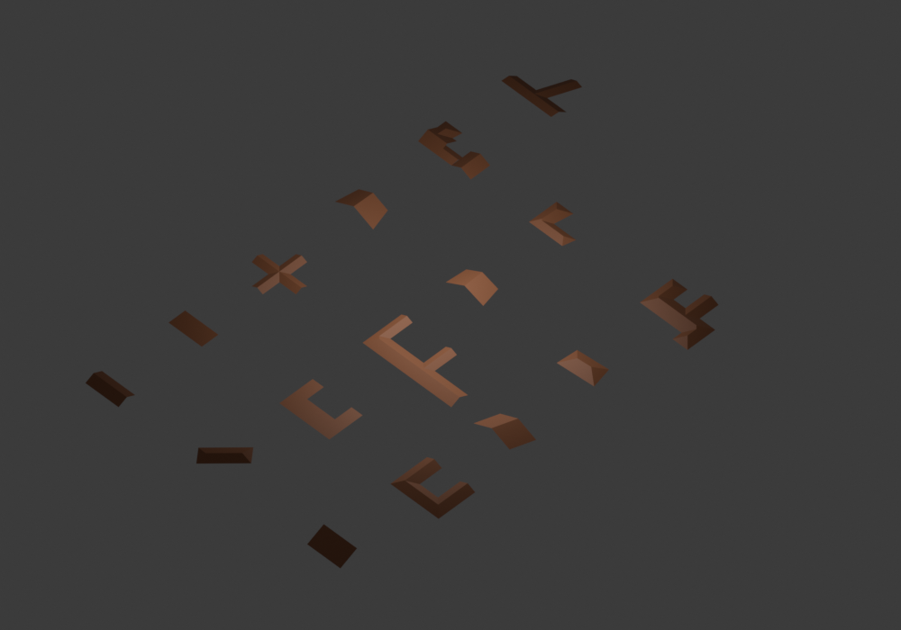

# Arbitrary-angle polygon roofs

## Geometry and model contract

Baseline: `21bd06a`. Footprint analysis, indexed Graph incidence, declared
support planes and fixed-plane embedding already use actual geometric directions.
The bounded bundled Straight Skeleton accepts normalized simple polygons;
the core wrapper currently rejects nonorthogonal input before calling it.

Two polygon model classes use the same incidence and downstream pipeline:

- **Hip:** every exterior edge is explicitly an eave. No gable selection,
  rectangular partition or axis preference is involved.
- **Terminal gable:** selected exterior edges replace oriented triangular caps
  by their two incident slope sectors. Each cap must have two unique sectors,
  and their inward unit normals must be opposed within the bounded numerical
  allowance below. Other exterior
  edges are explicitly eaves. This is a mixed hip/gable model, not a promise
  of pure gables at every building end.

The local condition involves parallel support lines, not a 90-degree corner.
For equal pitch and eave height, their equality locus is the line midway between
the supports. A straight cap edge joining the supports meets that line at its
midpoint even when oblique. The preserved skeleton event lies on the same
locus. Thus the existing disk replacement and BoundaryPoint(edge, 0.5) remain
geometrically derived, without changing incidence after geometry solving.

Blender stores vertex coordinates in float32: a nominally parallel branch with
decimal coordinates can have neighboring directions differing by about `1e-7`.
The normal allowance is `min(1e-6, max(1e-8, 8*EPS*(1/length_left +
1/length_right)))` in normalized perimeter units, where `EPS=2e-9`. The
length-dependent bound reflects coordinate noise; its ceiling prevents a short
edge from admitting meaningful angle changes. A 0.1-degree eave difference is
outside this allowance. No support vector or footprint vertex is rotated.

For bounded rounding, use the actual equal-distance cap parameter
`t=d_right(a)/(d_left(b)+d_right(a))`; exactly parallel supports give `t=0.5`.
Its boundary XY remains fixed. Form ridge direction from the real incident plane
equations and leave ridge Z variable where nonparallel eaves do not justify a
constant-width height anchor. The linear solver consumes these constraints
unchanged; it does not infer a different topology. This small GeometryProblem
extension is necessary to use real Blender inputs without snapping oblique
supports or accepting nonplanar output.

Triangular incidence is a separate condition: opposed neighboring boundary
supports alone do not guarantee a triangular terminal cap. Unavailable or
conflicting disks must remain inspectable. No coordinate perturbation,
rectification, Boolean, alternate seed or runtime retry repairs a failed event.

## Exterior interpretation

Orthogonal gable requests retain the current rectangular guide and componentwise
axis preference, with unchanged candidate family and IDs. Single convex-quad
gable requests retain their existing two-direction primitive contract, including
nonparallel eaves. Neither minimum rectangle partition nor its cells are
generalized to arbitrary angles.

For other nonorthogonal gable requests, the architectural domain is explicitly
restricted to opposed-support terminal caps. Enumerate every maximal compatible
cap set, meaning no further admissible gable can be added without consuming
another cap's required slope sector. This uses the existing componentwise
gable-over-hip preference, without inventing long-axis or weighted scores.
Maximal independent sets of the cap conflict graph can be enumerated as maximal
cliques of its complement, using bounded Bron–Kerbosch traversal. All surviving
models must produce and validate Graph, GeometryProblem and mesh before stable
seed selection. Incomplete enumeration exposes no selectable prefix.

Inspect both geometric eligibility and backend feasibility. A polygon with no
opposed-support terminal cap fails a gable request; it is not converted to hip.
Hip is generated only when explicitly requested.

## Responsibility boundaries

`wavefront` produces bounded immutable incidence for a normalized simple polygon.
`PolygonRoof` declares exterior ends and roof type. Cap-domain selection operates
on exterior support relations and disk conflicts. `polygon_roof.topology` applies
the existing disk replacement, facet aggregation and indexed incidence contract.
`GeometryProblem` declares real source planes; `plane_embedding` solves fixed
coordinates. `RoofMesh` validates the unchanged cycles. Blender only exports them.

The rectangular hip analytic shortcut currently assumes a pre-anchored primitive
apex. A polygon-incidence square has a junction with no such preassigned height.
Fully declared hip planes must therefore use the existing linear embedding;
the geometry solver must not infer pitch from incomplete height initialization.
The independent rectangle hip witness remains a regression contract.

## Verification

Preserve all 21 baseline orthogonal candidates, rejection records and seed IDs
in the embedding benchmark. Check arbitrary-angle hip and terminal-gable
face incidence directly, independently verify equal-pitch plane distances,
planarity, projection union and boundary ownership. Use rotation/translation,
winding/cyclic start, redundant collinear vertices and stable reference direction
as metamorphic proofs. Shear supplies stress inputs, not an equivalence oracle.

Probe convex quadrilaterals, two-direction structures, trapezoidal/mixed-angle
branches and general simple polygons as separate fixed corpora. Record topology,
solve and mesh outcomes separately; backend event failures remain unsupported.
Installed Blender smoke must exercise concave nonorthogonal gable and hip roofs,
not just numeric Graph construction. Record latencies without profiling and
retain unchanged event/model budget behavior.

Generalized nonterminal, partial or nonparallel-support compound gables are
outside this extension. The existing nonparallel single-quad gable contract is
not evidence that the terminal-cap rewrite handles those compound cases.

## Implemented outcomes

The baseline is `21bd06a`. `c8cee90` adds all-eave polygon hip; `b1c3277` adds
bounded terminal-set enumeration; `3a9dfd1` forms rounded cap and ridge constraints
from actual supports. `uses_polygon_model` is the single input/model dispatch
owner shared by generation and staged inspection. No new runtime dependency,
alternate-generator retry or generalized rectangular partition was introduced.
The cap operation extends the existing terminal-end adaptation documented in
[roof-end constraints](ROOF_END_CONSTRAINTS.md); it does not claim a general
nonparallel compound-gable grammar.

### Frozen input families

[angle_inputs_v1.json.gz](canonical/angle_inputs_v1.json.gz) contains 392 requests,
generator version 1 and seed 982143. Each geometry family is audited separately
for gable and hip. The two-direction generator applies different invertible
shears, stretches and rotations to parameterized building structures. This is
stress input, not an affine roof-equivalence oracle. Existing mixed-angle and
general-simple probes are included unchanged.

| Corpus / request | Inputs | Footprint | Model stage eligibility | Architecture | Graph / problem | Solve / mesh |
| --- | ---: | ---: | ---: | ---: | ---: | ---: |
| Convex quad gable | 48 | 48 | 48 | 48 | 48 | 48 |
| Convex quad hip | 48 | 48 | 48 | 48 | 48 | 48 |
| Mixed-angle gable | 43 | 43 | 43 | 43 | 43 | 43 |
| Mixed-angle hip | 43 | 43 | 43 | 43 | 43 | 43 |
| General simple gable | 40 | 40 | 40 | 0 | 0 | 0 |
| General simple hip | 40 | 40 | 40 | 40 | 40 | 40 |
| Oblique acceptance gable | 1 | 1 | 1 | 1 | 1 | 1 |
| Oblique acceptance hip | 1 | 1 | 1 | 1 | 1 | 1 |
| Two-direction gable | 64 | 64 | 64 | 63 | 63 | 63 |
| Two-direction hip | 64 | 64 | 64 | 63 | 63 | 63 |

The audit's historical `partition` success flag is eligibility at the model
stage. Polygon requests explicitly record `partition_required=false`, count zero
and scope "not required"; they do not perform Cell decomposition. Convex-quad
gable retains its one-Cell primitive contract. See the
[full summary](angles/final-coverage.json) and [all records](angles/final-coverage.jsonl.gz).
Blender is unmeasured in this Python corpus audit, not a failed conversion.

The 40 general gable requests have no admissible opposed-support terminal cap:
failure owner is architecture. Hip succeeds on the same inputs, but is never
substituted for those gable requests. One two-direction geometry fails both types
at the bundled incidence backend's antiparallel event; this is a topology failure,
not incomplete search or a seed decision. All other requested roofs reach
validated mesh. This finite corpus does not establish all simple polygons are
supported by the bundled implementation.

### Concrete Graphs and numerical proofs

The saved oblique acceptance has two geometrically opposed candidate boundary
edges, two triangular caps and one blocked cap. One opposed edge is nonterminal;
it does not enter the terminal-cap domain. The resolved model has one gable end
and five eaves, with five facets, one ridge, one valley and five hips. Its all-eave
hip has six facets, one ridge, one valley and seven hips. Both are planar,
connected disk surfaces. They are inspectable as
[gable Graph](angles/inspection-gable.json) / [drawing](angles/inspection-gable-candidate-0.svg)
and [hip Graph](angles/inspection-hip.json) / [drawing](angles/inspection-hip-candidate-0.svg).

The oblique three-ended branch has three gable ends, four merged slope facets,
two retained ridges and two valleys, with no independent internal gable cap.
It also passes with float32 vertex coordinates and the real Blender adapter.
The footprint coverage witness uses those quantized coordinates, not an idealized
building outline. A true nonparallel eave difference remains blocked.

Independent tests check source plane distances, SVD planarity, projected polygon
union and area, Euler disk, fixed boundary and exact face cycles. Rigid transform,
winding, cyclic start and redundant-vertex tests preserve physical selection with
the rotated reference direction. Exhaustive small conflict-graph oracles verify
the maximal-set producer, including blocked ends and invalidation of budget-limited
prefixes. Failed events never retry through convex-quad generation or change type.

[Orthogonal comparison](angles/comparison.json) preserves all 21 baseline
candidates across L/T/U/Cross/Residential/Grid14/20: model/rejection records,
completion/work fields, indexed Graphs, GeometryProblems and four seed decisions
are exactly identical, with zero coordinate difference. Grid40 has the same
explicit event rejection. Final angle audit preserves all stage results, selected
IDs, valid candidate counts and terminal domains from the pre-rounding audit.
The [995 historical mesh comparison](angles/witnesses.json) still passes all
cases, with maximum coordinate distance `3.1031676915590914e-17`.

The complete local 239-test suite passes; the final developer inspection proof
also passes in the focused 10-test angle suite. Installed ZIP Blender smoke passes
16 mesh cases, normals/manifold/UV/material/provenance, seed variation and atomic
failure. Native-base smoke passes four rectangle types, seven compound
differentials, saved-v1 cache invalidation and live updates. Cache proof namespace
is now `canonical-polygon-v2` because the hip model scope and candidate IDs changed.



### Unprofiled performance

Nine samples after one warm-up, Python 3.12.14, same Linux workspace. Whole
polygon candidate generation includes footprint analysis and every candidate's
embedding and mesh validation. Stage figures come from a separate instrumented
sample and must not be added to the unprofiled median.

| Polygon request | Total median ms | Embedding ms | Mesh validation ms |
| --- | ---: | ---: | ---: |
| Parallelogram hip | 3.839 | 0.097 | 1.891 |
| Trapezoid hip | 9.804 | 0.614 | 0.642 |
| General convex quad hip | 8.991 | 0.101 | 0.372 |
| Oblique L gable | 7.274 | 1.750 | 1.427 |
| Oblique L hip | 9.559 | 0.170 | 3.797 |
| Angled branch gable | 11.787 | 0.124 | 3.599 |

One valid candidate is materialized per measured request. Raw samples, all stage
timings and candidate/seed snapshots are in
[angle performance](angles/angle-performance.json.gz). Observed sample spread is
substantial; this is not a hard interactive latency guarantee. Raw orthogonal
before/final measurements are retained with the comparison rather than claiming
a performance gain for this input-scope extension. No candidate pruning or
validation weakening was used.

```bash
python python/generate_angle_corpus.py --output python/out/angle-inputs.json.gz
python python/audit_coverage.py --corpus python/docs/canonical/angle_inputs_v1.json.gz --seconds 15 --output python/out/angles.json --details python/out/angles.jsonl.gz
python python/benchmark_embedding.py --inputs python/docs/angles/performance-inputs.json --samples 9 --output python/out/angle-performance.json.gz
python python/inspect_roof.py --fixture oblique_L --roof-type gable --output python/out/oblique.json
python python/verify_plane_witnesses.py --output python/out/witnesses.json
python -m unittest discover -s python/tests
python python/build_addon.py --check --output packages/roof_generator-1.5.0.zip
blender -b --factory-startup --python-exit-code 1 --python python/blender_smoke_test.py -- --zip packages/roof_generator-1.5.0.zip --output-dir python/out/angle-blender --render
```

Next limits are nonterminal/partial or genuinely nonparallel-support compound
gables, the unresolved skeleton event, and broader shed/flat model domains.
The solver and mesh validators remain common; there is no general quadrilateral
decomposition or arbitrary-angle roof grammar hidden behind this release.
