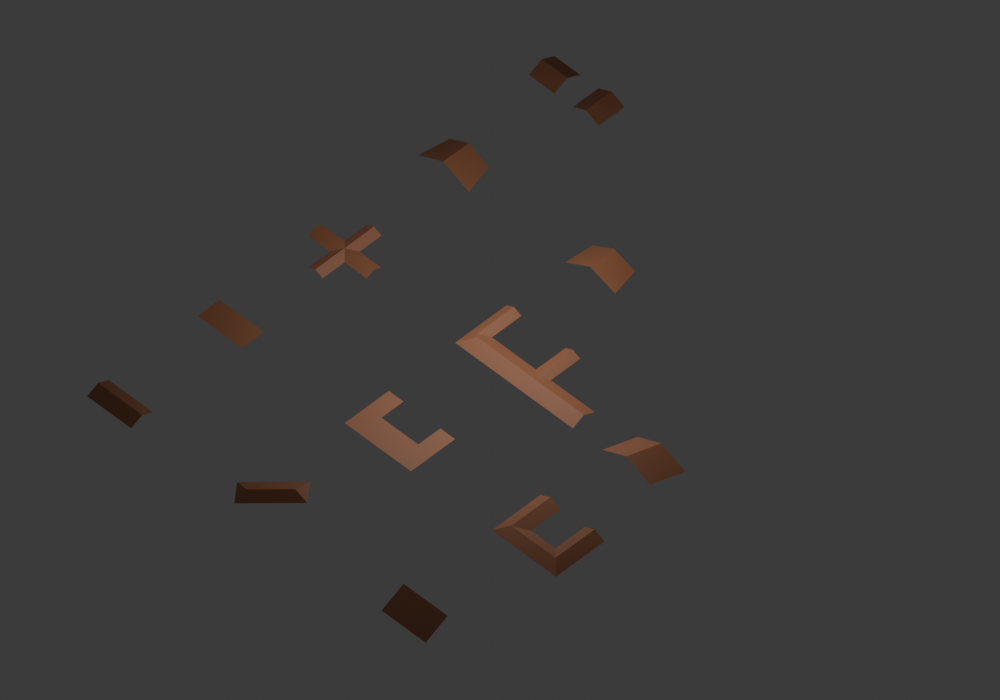

# Solved-roof coverage and embedding evaluation

## Scope and reproducibility

Baseline: `bcc4213f692ee2982fc0886a58ec79a2ef5761e2`. The canonical pipeline is
Footprint → minimum partition alternatives → architectural interpretations →
valid topology candidates → stable seed → GeometryProblem → fixed-topology
embedding → validated mesh → Blender. Runtime is Python's standard library.
No dependency, alternative generator, topology repair or failure fallback was added.

`canonical/coverage_inputs_v1.json.gz` freezes six distinct input categories,
generator version 1, seed 382901, SHA256
`c10977302f63aa3d1c10c9c876664800ee36cf63d76f07a0c88f19a7c9ccb534`.
The grid category preserves the existing seed-92821 connected-grid inputs.
Independent coordinate intervals distinguish nonuniform orthogonal inputs from
uniform grid scaling. Oblique shears are probes, not Euclidean equivalence tests.
The supplemental branch-network corpus freezes version 1, seed 69712, and tests
the new restricted connection operation; it is not an unbiased housing sample.

Every audit uses seed zero, without retrying another seed after a failed solve.
Baseline and current aggregate results are stored separately, with source SHA
and dirty-source metadata. Raw detailed diagnostics stream to compressed JSONL.
Historical measurement files remain dated evidence, not current capability claims.

## Stage coverage

The current core results are `canonical/coverage_solved.json` and
`canonical/coverage_branch_network.json`. Actual Blender 4.3.2 results are
`canonical/coverage_blender.json` and `canonical/coverage_branch_network_blender.json`.
Blender was attempted for every core-valid mesh, including editing, UV unwrap,
material, provenance attributes, positive normals and manifold-with-boundary checks.

| Corpus | Inputs | Footprint | Partition | Architecture | RoofGraph | GeometryProblem | Solve | Mesh | Actual Blender |
| --- | ---: | ---: | ---: | ---: | ---: | ---: | ---: | ---: | ---: |
| Orthogonal connected-grid stress | 1000 | 1000 | 1000 | 1000 | 3 | 3 | 3 | 3 | 3/3 attempted |
| Nonuniform orthogonal | 150 | 150 | 150 | 150 | 0 | 0 | 0 | 0 | 0 attempted |
| Structured orthogonal | 103 | 103 | 103 | 103 | 13 | 13 | 13 | 13 | 13/13 attempted |
| Single convex quadrilateral | 48 | 48 | 48 | 48 | 48 | 48 | 48 | 48 | 48/48 attempted |
| Structured oblique compound | 43 | 43 | 0 | 0 | 0 | 0 | 0 | 0 | 0 attempted |
| General simple polygon probe | 40 | 40 | 0 | 0 | 0 | 0 | 0 | 0 | 0 attempted |
| Supplemental separated branch network | 100 | 100 | 100 | 100 | 100 | 100 | 100 | 100 | 100/100 attempted |

Unattempted Blender conversions are censored by earlier failures, not Blender
failures. CPython audit files explicitly mark Blender unmeasured. Convex-quad
"partition" means the supported one-cell decomposition, not a rectangular
minimum-count certificate. These categories must not be combined into one support rate.

At the baseline, the first three categories reached the same 3/0/13 topology
counts, but no compound pitched solve or mesh succeeded. All 48 convex quads
failed decomposition. The supplemental branch corpus was separately run against
`b6a5928`: 100 completed partitions/interpretations, zero RoofGraphs. The same
frozen inputs now reach 100 solved meshes and 100 actual Blender conversions.
The unknown-grid topology count has **not** improved. Within its 997 failures,
980 exhaust the implemented assignment family and 17 exhaust the explicit
axis-assignment budget. The latter are incomplete searches, not evidence that no
valid roof exists. Deferring ranking explores more assignments and exposes five
additional budget failures compared with the baseline; the budget was not increased.

## Relation blockers and research boundary

The following counts are building incidence across **all examined assignments**
in the grid corpus. A supported building may also have rejected assignments.
"Sole" means at least one assignment with only that known blocker, counted once
per building/code; downstream errors are censored. It is not a predicted rescue count.

| Relation | Nonexclusive incidence | Conditional sole assignment | Owner / evidence | Implementation decision |
| --- | ---: | ---: | --- | --- |
| parallel | 999 | 925 | Architecture and undefined topology contract, B/C/F unresolved; Hu parallel penalty is not a junction template | No invented parallel operation |
| continuation | 809 | 38 | Width-step/axis-offset members, missing continuation contract; aligned equal-width union would contradict minimum cell count | No ordinary ridge-continuation substitution |
| partial_end | 805 | 61 | Incomplete branch cap, interpretation and template ambiguity B/F | No partial-cap graft |

[ORTHOGONAL_BLOCKERS.md](ORTHOGONAL_BLOCKERS.md) maps Hu 2017 §§3.3–3.5,
Laycock 2003 §7/Fig.6, Sugihara 2007 pp.312–313/Figs.4–6 and Kada 2009 §2.4/Fig.11
to current relation contracts. The additional all-minimum-candidate probe found
no alternative-partition rescue in the searched grid family. That does not prove
impossibility or completeness over every reflex processing order. Cases without
a published incidence or explicit architectural contract remain inspectably
unsupported; their vocabulary alone does not prove a missing graph rewrite.

The implemented improvement combines established terminal and middle incidence
**simultaneously** where their neighborhoods cannot interact: one receiver,
exterior leaf branches, full branch caps, distinct receiver-end terminal ports,
strictly narrower middle ports, disjoint middle intervals outside the terminal
replacement enclosure. Receiver face cycles are rewritten once, preserving the
main ridge and allocating branch termination/valleys. No sequential union or
shape classifier is involved. This is an explicitly documented indexed adaptation
of researched operations, not a newly attributed general published algorithm.
An independent six-face witness has three ridge, three valley and two hip edges;
the two-terminal/two-middle proof has ten faces, five ridges, six valleys and four
hips. Tests cover relation ordering, rigid transforms and interacting-port rejection.

Hu ranking now applies after topology validity: its existing score selects the
best **valid** candidates, rather than eliminating a lower-ranked interpretation
whose junction is implemented. Hu reports correct alternatives at ranks 2–4;
there is no claim that only first rank is feasible. Neither scores nor minimum
guarantees nor seed namespaces changed. Genuine valid ties remain seedable.

## Geometry solve

[SGA21_SOLVER.md](SGA21_SOLVER.md) specifies Ren 2021 §§4.1–4.2/equations 1–2 and
the historical MATLAB/Python differences. The objective is the sum of the smallest
face covariance eigenvalues, with the published squared XY displacement term.
Deterministic Jacobi eigensolving and standard damped nonlinear least squares
use only the standard library. Fixed boundary XY, fixed Z anchors and linear
ridge-direction constraints are eliminated from the free coordinates. Explicit
eave-origin/pitch constraints belong to GeometryProblem, not solver inference.
The regularization continuation `1e-4 → 1e-8 → 0` obtains strict planarity instead
of accepting a permanently regularized nonplanar surface.

Acceptance requires point-to-best-fit-plane, pitch signed-distance and ridge
direction residuals below `4e-9` in perimeter-normalized units. Exhaustion or
contradictory constraints fails explicitly. Face cycles, boundary ownership,
ridge/valley/hip labels and candidate choice are unchanged by optimization.
NumPy covariance/SVD and literal authored equal-pitch terminal-network vertices
independently check the result. L/T/U/Cross solve; projected faces are positive,
noncrossing, cover exactly the footprint and form the original topological disk.
Mesh conversion uses the same shared vertex indices and polygon cycles.

Installed-addon smoke creates editable U, Cross and mixed pitched meshes, the
four rectangle types, compound flat, and all three named convex quad fixtures.
It verifies transformed objects, seed variation, UV/material/provenance and
atomic rejection. Output surfaces intentionally have an exterior boundary;
walls/thickness are separate modeling tasks.

## Non-orthogonal scope

Parallelogram, trapezoid and general convex quad all reach topology, nonlinear
solve, validated mesh and actual Blender. Both opposite-eave gable choices are
valid candidates. Equal signed perpendicular distances determine the boundary
ridge ports; nonparallel eaves yield a sloping ridge. This is an explicit new
two-slope equal-pitch primitive contract, not an alleged Hu rectangular rule.
Flat/shed use the same one-cell contracts; nonrectangular hip remains unsupported.
The declared ridge direction is geometric, not universal axis 0/1.

`oblique_L` is valid at footprint analysis and rejected at decomposition. A visible
reflex extension can yield two convex quads, but the surveyed rectangle methods
do not justify generalized partition selection or a nonperpendicular junction.
[NON_ORTHOGONAL.md](NON_ORTHOGONAL.md) identifies decomposition, angled full-end/
side interpretation and incidence/pitch feasibility as separate missing owners.
Neither a shear equivalence assertion nor a 90-degree rectification is used.

## Performance evidence

The measurements use the same fixture coordinates, candidate family,
interpretations, ambiguity and four seed decisions. Raw unprofiled samples and
fingerprints are stored in `canonical/embedding_performance_*.json`; Python 3.12.14,
no persistent cache. Wall time in this shared execution environment varies
substantially; independent repeated measurements are reported rather than a
guaranteed throughput claim. Optimization has a separate budget from 2D work.

The repeat uses nine unprofiled samples after two warmups. The before source
is `829d830` (same operations, before provenance reuse); after source is
`5f1702e` with the recorded working-tree embedding changes. All six family/seed
fingerprints match. Times are median milliseconds; an absent solve means
topology unsupported, not a fast successful roof. Seed timing covers 0/1/7/42.

| Input | Partition before→after | Architecture after¹ | Topology after | Seed after | 2D before→after | Solve after | Mesh after | Core after |
| --- | ---: | ---: | ---: | ---: | ---: | ---: | ---: | ---: |
| U | 6.32→6.80 | 0.83 | 17.44 | 0.039 | 18.58→26.05 | 477.56 | 1.28 | 506.75 |
| Cross | 3.72→3.02 | 0.58 | 11.88 | 0.051 | 16.93→15.84 | 61.25 | 2.03 | 90.52 |
| Residential | 4.93→4.34 | 1.77 | 2.95 | 0.000 | 10.75→9.71 | — | — | 9.71 |
| Grid14 | 30.15→21.16 | 11.00 | 4.54 | 0.000 | 51.02→37.97 | — | — | 37.97 |
| Grid20 | 35.25→27.32 | 13.64 | 8.35 | 0.000 | 61.28→49.70 | — | — | 49.70 |
| Grid40 | 185.00→184.50 | 119.03 | 88.14 | 0.000 | 392.93→414.89 | — | — | 414.89 |

¹ Sum of reported interpretation/evaluation/part-construction medians; the raw
JSON separates these stages. The median total need not equal summed medians.

U converges in 44 iterations with maximum covariance-plane distance `2.29e-14`,
pitch distance `4.86e-14` and zero ridge-direction error. Cross takes 37 iterations,
plane distance `5.20e-18`, zero pitch and direction errors (normalized units).

The repeated-six-fixture 1000-input performance batch generates **334 meshes**
(two supported fixtures, four rejected; not 334 unique supported buildings).
Before provenance reuse: **222.91 s**; after: **369.23 s**, measured in independent
runs. The initially measured after Grid40 2D median was 881.30 ms, versus 414.89 ms
in the repeat. This variability and the slower batch do **not** demonstrate an
end-to-end speedup. The deterministic call-count reduction is proven; throughput
requires further controlled measurement and optimization. These batches do not
measure the unknown-grid corpus and must not be called its support rate.

Grid40 still has 48 minimum candidates and 116 work visits. The exact footprint-
local provenance cache reduces exterior span computation from **2030 to 54 calls**;
cache-disabled candidate equality is tested. Cell corners are computed once for
sorting and materialization. No candidate pruning, precision reduction or
validation removal occurs. Instrumented inclusive costs, which must not be added
as independent stages, are in `embedding_profile_before/after.json` and cProfile
summaries. Noding and face cycles remain dominant subdivision work. The single-
digit millisecond 40-vertex target is unmet.

## Remaining scope

- Unsupported **within the current contract**: partial-end, parallel,
  width-step/offset continuation, interacting or multi-receiver junctions lacking
  justified incidence. These are not proven impossible roofs.
- Unresolved architectural interpretation and incomplete assignment searches are
  reported separately from geometric impossibility and valid seed ambiguity.
- Non-orthogonal compound decomposition and angled connections; arbitrary
  convex-polygon primitives and nonrectangular hip feasibility.
- Compound hip/shed direction and incidence. Compound flat remains one face.
- Solver feasibility and convergence for future topologies; topology validity
  does not by itself promise embedding. Current supported pitched graphs already
  reach Blender. No Geometry Nodes backend is implemented.
