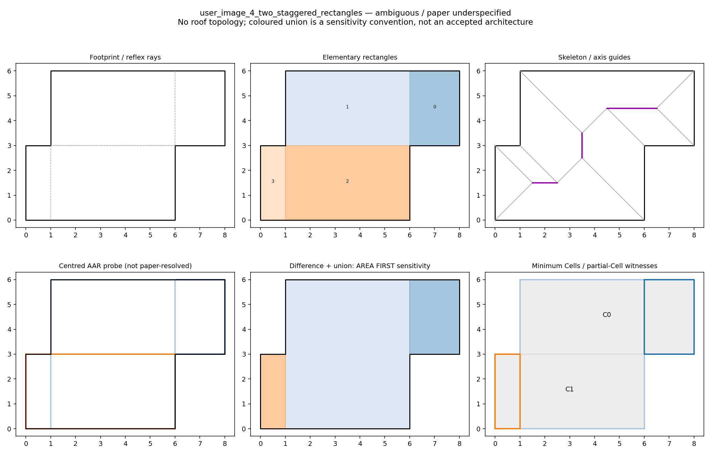

# Laycock region aggregation diagnostic

The user authorized section 7 Steps 1–5 as an ArchitecturalPart aggregation
guide. Skeleton edges must never become final roof ridges, valleys or a
RoofGraph backend. This diagnostic changes no production generation code,
ArchitecturalPart schema, addon dependencies or installed ZIP.

## Method and source limits

The [publisher paper](https://dspace.zcu.cz/bitstream/11025/991/1/G67.pdf)
specifies reflex-ray elementary rectangles, axis-aligned skeleton guides,
AAR growth, rectangle collection, set difference and union before roof-model
assignment. Its text does not specify a complete growth stopping rule or a
general collection ownership priority.

`laycock_regions.py` reproduces the reflex-ray subdivision and obtains a
straight skeleton through the optional `py_straight_skeleton` 0.1.0 library.
Library face coverage and node distance/time against original supporting
lines are checked for all 13 inputs. Those planar faces are a skeleton
validation oracle only; they are never output as roof faces. Source-unit
intrinsic coordinates are supplied without jitter. An orthogonal ray endpoint
uses the boundary's exact constant coordinate to avoid a dangling one-ULP
endpoint during subdivision.

Growth is an explicitly declared probe: enumerate maximal interior rectangles
on boundary coordinates, retain those containing a guide with that guide on
the transverse centreline. Unrestricted containing rectangles are recorded
separately. This centred interpretation reproduces all four raw collection
sets of Figure 4 on an approximate trace; it is not a general stopping rule
proved by the paper. The trace uses measured drawing coordinates, not the
authors' original footprint data.

Figure 4's printed Step 4 lists omit elementary rectangle 3, although the
Step 5 drawing appears to include it in the red rectangle. We record that
source inconsistency rather than silently repairing it. Matching the raw
collections does not establish which collection should own shared rectangles.
[Raw collection comparison](authority/laycock/figure4-check.json).

For every fully resolved growth probe with at most eight distinct collections,
all ordered first-claim set-difference permutations are enumerated. No priority
is selected as architectural truth. Three named conventions also include union
geometry for inspection. The six-panel images show the **large AAR area first**
sensitivity convention, not a proposed accepted roof architecture.

Minimum partition searches completed for all 13 inputs. Exact polygon
intersections compare each region with every retained minimum partition.
A region cannot claim a whole Cell from partial overlap. No nearest-Cell
assignment is used. Local common-owner domains are only necessary conditions;
the exhaustive ordered configurations provide the stronger conditional check.

## Results

Counts below are distinct labelled ownership configurations under the declared
ordered-difference family, not valid roofs. An exact configuration can be
represented on at least one retained minimum partition; a splitting
configuration cannot be represented on any of them. Different labels may
describe the same geometric partition. All results remain conditional on the
growth interpretation.

| Input | Overall classification | Exact configurations | Splitting configurations |
| --- | --- | ---: | ---: |
| Screenshot 1: four staggered bands | ambiguous / paper underspecified | 1 | 47 |
| Screenshot 2: three staggered bands | ambiguous / paper underspecified | 1 | 7 |
| Screenshot 3: band and lower corner | ambiguous / paper underspecified | 2 | 8 |
| Screenshot 4: two staggered rectangles | ambiguous / paper underspecified | 1 | 3 |
| S staggered reference | exact union of minimum Cells under this probe | 1 | 0 |
| U | ambiguous / paper underspecified | 4 | 0 |
| Residential multi-reflex | ambiguous / paper underspecified | 4 | 4 |
| Staircase | ambiguous / paper underspecified | 58 | 74 |
| Comb | ambiguous / paper underspecified | 1 | 15 |
| Grid14 | ambiguous / paper underspecified | 16 | 40 |
| Grid20 | ambiguous / paper underspecified: growth domain unresolved | — | — |
| Grid40 | ambiguous / paper underspecified: growth unresolved and one atom uncovered | — | — |
| Figure 4 approximate trace | ambiguous / paper underspecified | 8 | 2 |

The four screenshot approximations all produce larger central regions under
the area-first convention. They also retain residual attachment regions.
For screenshot 4, the central region is the rectangle `(1,0)`–`(6,6)`, with
left `(0,0)`–`(1,3)` and right `(6,3)`–`(8,6)` attachments. Both original
minimum Cells must be split to express that configuration. Another priority
returns the original two rectangles and can use whole Cells. Choosing that
priority merely because the current schema can express it would substitute
implementation convenience for the missing architectural decision.

Other screenshot diagnostics:
[1](authority/laycock/user_image_1_four_staggered_bands.png),
[2](authority/laycock/user_image_2_three_staggered_bands.png),
[3](authority/laycock/user_image_3_band_and_lower_corner.png).
Additional sanity checks:
[S reference](authority/laycock/S_staggered_reference.png),
[Figure 4 trace](authority/laycock/figure4_trace.png).

An earlier intermediate claim that screenshot 3's elementary rectangle crossed
a minimum Cell was a subdivision numerical artifact. Correcting the ray endpoint
removed it. The genuine witnesses here concern **aggregated regions** crossing
minimum Cell boundaries. The compatibility implementation also handles an atom
crossing a Cell through exact intersections, without assuming refinement.

## Production gate and remaining work

The gate is not met. Larger regions were demonstrated under a declared
interpretation, but paper-resolved growth and ownership have not been obtained.
No natural roof, RoofGraph or Blender result was generated by this diagnostic.
The four screenshots remain unsupported in production; previous coverage
counts and the ZIP are unchanged.

Both whole-Cell and splitting outcomes exist. Therefore `Part = set<Cell>`
is generally insufficient to represent the demonstrated roof-region candidate
family. This representational limitation is established; choosing an atom set
or an actual polygonal region as its replacement remains undecided.
Do not change the data model or select a priority simply to fit that model.
First resolve/document growth and ownership, explicitly retaining the Grid20
ambiguity and Grid40 uncovered atom. Then reassess representability of the
selected regions. Roof-model assignment and region merge incidence remain
separate, unimplemented contracts for these cases.

The subsequent [ownership/selection research](ROOF_REGION_SELECTION.md)
distinguishes published selection domains from the candidate/seed contract.

The prototype enumerates boundary-grid rectangles in O(nx² ny²), and priority
orders in O(k!) with a diagnostic limit of eight collections. It is not a
production performance design. Core generation performance was not changed.

## Reproduction and evidence

Commands are in [the Python README](../README.md). Seven focused tests verify
subdivision coverage, exact boundary intersection, partial-Cell rejection,
ownership nonconfluence and conditional enumeration. All seven passed.
Skeleton validity was checked separately by the full 13-input diagnostic run.

[Compressed full report](authority/laycock/report.json.gz) includes all inputs,
elementary rectangles, skeleton nodes/arcs, guides, growth domains, collections,
union variants, all retained minimum partitions and priority configurations.
[Manifest](authority/laycock/manifest.json) pins source, fixture and evidence
hashes and dependency versions. Optional diagnostic dependencies remain outside
the addon and package archive.
