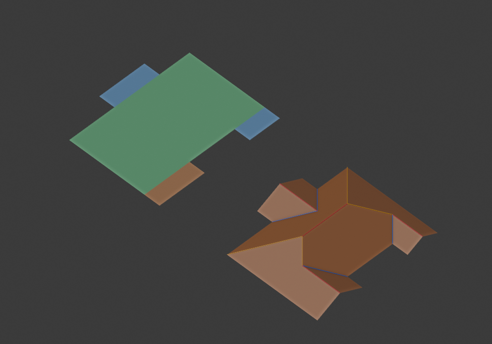

# Opposite-eave mixed attachments

The shared composer now admits a proved subset previously rejected by the
conservative terminal/middle neighborhood test. This is an applicability repair
of existing simultaneous incidence, not a new junction operation or a rule
that every known relation must become a roof connection.

## Architecture and applicability

One declared rectangular receiver has distinct terminal ends and strictly
narrower middle branches. Terminal shared-end choices have already been
resolved globally. The receiver's opposite slope can host a narrow middle
branch when the terminal branch is strictly narrower than its receiver.

At common pitch, a narrow middle branch penetrates its receiver by half its
transverse width. A lower shared corner on the opposite eave leaves a 45-degree
hip from that slope's outer corner. The middle apex must remain strictly
beyond that hip, inside the same receiving slope. The graph's cycles are then
the existing simultaneous `_terminals` cycles: neither port is discovered from
solved geometry, and no extra internal cap/valley is added.

The previous `max(host_width, branch_width)` exclusion was imposed on **both**
receiving slopes. The new predicate retains that exclusion for same-side,
equal/wider terminal and unproved arrangements. Only a strictly lower terminal
on the opposite eave uses the analytic apex/hip condition. Interacting middle
slots still reject. There is no fixture-name branch.

Published basis remains the narrow-to-wide branch extension and shared L/end
model already documented in `ROOF_COMPOSITION_RESEARCH.md`. The side-specific
applicability predicate is our bounded adaptation; it is not claimed to be a
general scheduling theorem from the papers.

## Independent proof and image 2

The causal regression uses the screenshot approximation's central support
`(2,0)`–`(7,8)`, left middle `(1,3)`–`(2,6)`, right lower terminal
`(7,0)`–`(8,3)` and right upper terminal `(7,6)`–`(8,8)`.
Previously the resolved shared/shared/extension candidate rejected with
`mixed junction neighborhoods interact`. It now has 20 vertices and 8 faces.

`test_opposite_attachments.py` supplies literal metric coordinates without
calling the solver. Main half-width 2.5 puts its two junctions at `(4.5,2.5)`
and `(4.5,5.5)`, height 1.25 at pitch .5. The middle branch ridge meets the left
slope at `(3.5,4.5,.75)`. Lower and upper terminal branch junctions are
`(5.5,1.5,.75)` and `(6,7,.5)`. All projected faces cover the footprint, form a
disk, are planar at pitch .5 and have valid semantic incidence under `RoofMesh`.
No entire internal valley is a height-zero independent-roof seam.

An equal-width terminal counterexample stays outside the strict lower-branch
proof and rejects before composition. Existing same-side near-end and
equal-width-middle rejections remain covered by the older tests.



Left: actual supports crossing minimum Cells. Right: installed Blender 5.2.2
LTS roof. Red ridge, blue valley, yellow hip. This is explicit proposal API
acceptance, not default footprint operator acceptance. Full 166-test suite
passed. Both image 2 and image 4 rendered from an isolated installed ZIP.

The end-choice iterator is now consumed only up to the remaining work budget.
A regression uses an infinite repeating end iterator and proves that candidate
construction returns incomplete with no seed winner, instead of materializing
the unbounded iterator. This preserves all choices within the declared budget;
it does not prune candidates by appearance or implementation preference.

## Another proposal source, still diagnostic

`probe_receiver_regions.py` enumerates all maximal contained rectangles whose
coordinates come from the footprint boundary, then declares each connected
rectangular residual as an exterior leaf. All maximal receivers are retained;
no area priority chooses an owner. Residuals that are not rectangles reject
this model family. This producer defines distinct leaves from the outset;
it does not split a disconnected Laycock collection into new owners.

The grid subdivision is temporary geometry computation, not Cell or Atom
semantics. All proposed polygons enter the existing `propose_regions` contract.
The maximal receiver criterion removes contained receiver hypotheses; it is
part of this explicit restricted family, not a complete set of every possible
architecture. Its exhaustive coordinate loops are suitable only for these
bounded diagnostics, not an optimized production generator.

| Screenshot | Receiver proposals | Embedded roofs |
| --- | ---: | ---: |
| 1 | 0 | 0 |
| 2 | 2 | 1 |
| 3 | 2 | 0 |
| 4 | 3 | 1 |

Image 1 leaves nonrectangular residuals; all 6 maximal receivers reject this
restricted family. Image 3's 2 proposals reach undefined parallel, offset or
partial-end combinations. Therefore no default generator integration is
claimed. Missing compound leaf models/merge incidence cannot be inferred from
provenance or replaced by appearance scoring.

## Coverage status

The previous shared-layout change's full frozen audit has now completed:
grid 3/1000, nonuniform 0/150, structured 13/103, quadrilateral 48/48 all reached
graph, solve and mesh. The report is saved with that phase's code provenance;
it does not claim measurements of this new applicability predicate.
The new full frozen audit is running separately. Default proposal discovery
continues to use the existing minimum source. The four-case operator gate
remains unmet, even though explicit proposals now embed for 2 of 4 cases.

```sh
python python/probe_opposite_attachments.py
python -m unittest discover -s python/tests -p test_opposite_attachments.py
python python/probe_receiver_regions.py --inputs python/tests/fixtures/user_roof_images_v1.json --output python/out/authority/receiver-probe.json
python python/inspect_region_roofs.py --input python/docs/authority/regions/candidates.json --output python/out/authority/opposite-region-roofs.json
```
