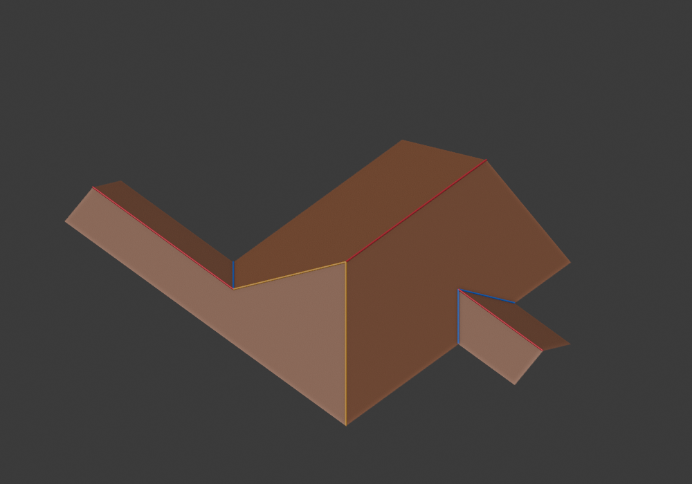
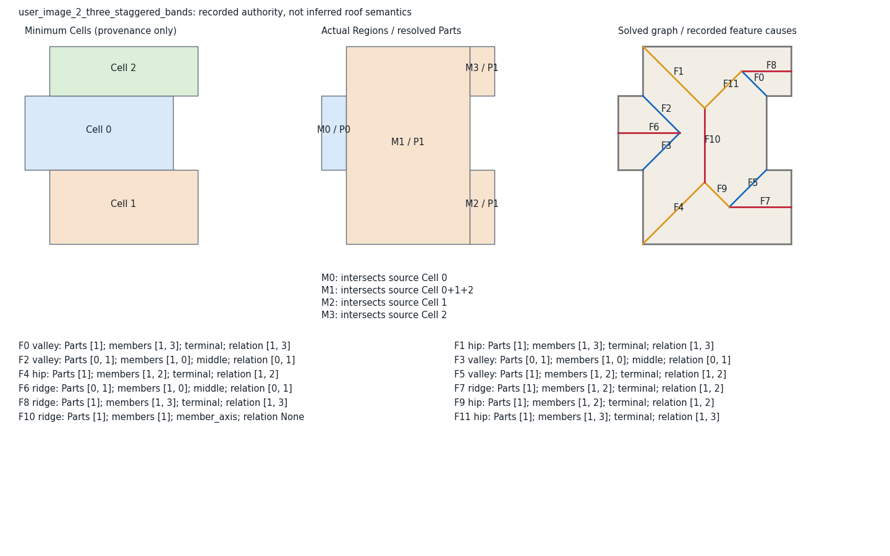

# Opposite-eave mixed attachments

The shared composer now admits a proved subset previously rejected by the
conservative terminal/middle neighborhood test. This is an applicability repair
of existing simultaneous incidence, not a new junction operation or a rule
that every known relation must become a roof connection.

## Architecture and applicability

One declared rectangular receiver has distinct terminal ends and strictly
narrower middle branches. Terminal shared-end choices have already been
resolved globally. The receiver's opposite slope can host a narrow middle
branch when the terminal branch is strictly narrower than its receiver.

At common pitch, a narrow middle branch penetrates its receiver by half its
transverse width. A lower shared corner on the opposite eave leaves a 45-degree
hip from that slope's outer corner. The middle apex must remain strictly
beyond that hip, inside the same receiving slope. The graph's cycles are then
the existing simultaneous `_terminals` cycles: neither port is discovered from
solved geometry, and no extra internal cap/valley is added.

The previous `max(host_width, branch_width)` exclusion was imposed on **both**
receiving slopes. The new predicate retains that exclusion for same-side,
equal/wider terminal and unproved arrangements. Only a strictly lower terminal
on the opposite eave uses the analytic apex/hip condition. Interacting middle
slots still reject. There is no fixture-name branch.

Published basis remains the narrow-to-wide branch extension and shared L/end
model already documented in `ROOF_COMPOSITION_RESEARCH.md`. The side-specific
applicability predicate is our bounded adaptation; it is not claimed to be a
general scheduling theorem from the papers.

## Independent proof and image 2

The causal regression uses the screenshot approximation's central support
`(2,0)`–`(7,8)`, left middle `(1,3)`–`(2,6)`, right lower terminal
`(7,0)`–`(8,3)` and right upper terminal `(7,6)`–`(8,8)`.
Previously the resolved shared/shared/extension candidate rejected with
`mixed junction neighborhoods interact`. It now has 20 vertices and 8 faces.

`test_opposite_attachments.py` supplies literal metric coordinates without
calling the solver. Main half-width 2.5 puts its two junctions at `(4.5,2.5)`
and `(4.5,5.5)`, height 1.25 at pitch .5. The middle branch ridge meets the left
slope at `(3.5,4.5,.75)`. Lower and upper terminal branch junctions are
`(5.5,1.5,.75)` and `(6,7,.5)`. All projected faces cover the footprint, form a
disk, are planar at pitch .5 and have valid semantic incidence under `RoofMesh`.
No entire internal valley is a height-zero independent-roof seam.

An equal-width terminal counterexample stays outside the strict lower-branch
proof and rejects before composition. Existing same-side near-end and
equal-width-middle rejections remain covered by the older tests.


Left: actual supports crossing minimum Cells. Right: installed Blender 5.2.2
LTS roof. Red ridge, blue valley, yellow hip. This is explicit proposal API
acceptance, not default footprint operator acceptance. Full 167-test suite
passed. Both image 2 and image 4 rendered from an isolated installed ZIP.

The end-choice iterator is now consumed only up to the remaining work budget.
A regression uses an infinite repeating end iterator and proves that candidate
construction returns incomplete with no seed winner, instead of materializing
the unbounded iterator. This preserves all choices within the declared budget;
it does not prune candidates by appearance or implementation preference.

## Another proposal source, still diagnostic

`probe_receiver_regions.py` enumerates all maximal contained rectangles whose
coordinates come from the footprint boundary, then declares each connected
rectangular residual as an exterior leaf. All maximal receivers are retained;
no area priority chooses an owner. Residuals that are not rectangles reject
this model family. This producer defines distinct leaves from the outset;
it does not split a disconnected Laycock collection into new owners.

The grid subdivision is temporary geometry computation, not Cell or Atom
semantics. All proposed polygons enter the existing `propose_regions` contract.
The maximal receiver criterion removes contained receiver hypotheses; it is
part of this explicit restricted family, not a complete set of every possible
architecture. Its exhaustive coordinate loops are suitable only for these
bounded diagnostics, not an optimized production generator.

| Screenshot | Receiver proposals | Embedded roofs |
| --- | ---: | ---: |
| 1 | 0 | 0 |
| 2 | 2 | 1 |
| 3 | 2 | 0 |
| 4 | 3 | 1 |

Image 1 leaves nonrectangular residuals; all 6 maximal receivers reject this
restricted family. Image 3's 2 proposals reach undefined parallel, offset or
partial-end combinations. Therefore no default generator integration is
claimed. Missing compound leaf models/merge incidence cannot be inferred from
provenance or replaced by appearance scoring.

The later `--receiver-family all` probe also includes contained receiver
rectangles. Restricting proposals to maximal receivers is therefore no longer
an untested explanation for these failures. It tests the finite coordinate
family induced by the original footprint vertices, not arbitrary free receiver
positions or compound support models:

| Screenshot | Nonrectangular residual rejection | Accepted support proposals | Embedded roofs |
| --- | ---: | ---: | ---: |
| 1 | 26 | 0 | 0 |
| 2 | 7 | 5 | 1 |
| 3 | 14 | 3 | 0 |
| 4 | 2 | 5 | 1 |

These results identify the missing broader model family without making a new
unproved parallel/partial-end connection. They do not prove that no natural
roof exists for screenshots 1 and 3.

Kada & McKinley was reread at sections 2.2–2.4, printed pages 49–51. Its
junction replacement considers neighboring roof shapes **and their fitted
parameters**, obtained from LIDAR. Section 2.4 provides a compatibility and
selection principle, not indexed incidence for arbitrary offset footprint-only
models. It cannot supply missing roof parameters by naming a contact relation.
The paper's outline generalization and low-overlap-cell omission also cannot
be imported into this project's exact footprint coverage contract.
[Primary paper](https://www.isprs.org/proceedings/xxxviii/3-w4/pub/CMRT09_47.pdf).

The region pool now retains all producer proposals/provenance while searching
each geometric support set once. Its metadata representative is canonical by
source/provenance order, not whichever producer ran last. Inspection exposes
all sources; duplicates have one probability mass. Reversing source order now
preserves selected architecture metadata as well as graph ID and mesh. This
contract repair adds no usable roof scenario.

## Coverage status

The previous shared-layout change's full frozen audit has now completed:
grid 3/1000, nonuniform 0/150, structured 13/103, quadrilateral 48/48 all reached
graph, solve and mesh. The report is saved with that phase's code provenance;
it does not claim measurements of this new applicability predicate.
The new full frozen audit has completed. The installed ZIP converted every
successful mesh, including the new grid case:

| Corpus | Previous graph/mesh | Current graph/solve/mesh | Installed Blender |
| --- | ---: | ---: | ---: |
| Grid | 3/1000 | 4/1000 | 4/4 attempted |
| Nonuniform | 0/150 | 0/150 | no valid mesh to attempt |
| Structured | 13/103 | 13/103 | 13/13 attempted |
| Quadrilateral | 48/48 | 48/48 | 48/48 attempted |
| Supplemental branch | 100/100 | 100/100 | 100/100 attempted |

The supplemental branch selected IDs and valid-graph counts match the previous
100 inputs. Unsupported inputs remain unattempted in Blender; those counts
are not Blender failures. This remains poor general orthogonal coverage.

`generated_0356` is the newly available default-generator scenario, now fixed
in `opposite_grid_v1.json`. A read-only `0e65abc` snapshot rejects its only
otherwise applicable choice as mixed neighborhood interaction. Current code
uses one terminal and one opposite middle branch. Its 16-vertex, 6-face roof
has the analytic junctions `(10.5,4.5,2.25)`, `(7.5,1.5,.75)` and
`(13.5,7.5,.75)` at pitch .5. The regression verifies the declared operations,
metric junctions, unchanged graph/mesh incidence and no entire internal valley
at height zero. The installed footprint operator also generates and renders it.



This is a new usable frozen-corpus scenario, rather than an added test on an
already passing case. It is not one of the user's unrecovered original meshes.
Default proposal discovery continues to use the existing minimum source.
The four-case operator gate remains unmet, even though explicit proposals now
embed for 2 of 4 screenshot approximations.

The newer proposal inspection records actual source Cell intersections,
resolved region geometry, connection records and every feature cause. The
diagram puts all three layers in the same intrinsic frame:



The middle is not a recoloring of minimum Cells: its central member intersects
three source Cells. Feature records refer to model members/Parts and resolved
shared/extension decisions. A relation's presence alone is not the reason to
retain a junction; the selected model/end state and applicability proof must
also hold. Cell intersections are provenance, not topology instructions.

```sh
python python/probe_opposite_attachments.py
python -m unittest discover -s python/tests -p test_opposite_attachments.py
python python/probe_receiver_regions.py --inputs python/tests/fixtures/user_roof_images_v1.json --output python/out/authority/receiver-probe.json
python python/inspect_region_roofs.py --input python/docs/authority/regions/candidates.json --output python/out/authority/opposite-region-roofs.json
python python/region_diagrams.py --report python/out/authority/source-history-roofs.json --output-dir python/out/authority/source-history-diagrams
```

## Serial performance check

Candidate generation was measured serially on the read-only `0e65abc` snapshot
and current code, 3 samples after 1 warmup, 24 mixed buildings. All six measured
family fingerprints and seeded IDs match. These six cases exclude the new
`generated_0356` input and do not imply identical global coverage.

| Case | Before median ms | After median ms |
| --- | ---: | ---: |
| U | 18.63 | 15.73 |
| Cross | 23.94 | 17.05 |
| Residential | 21.98 | 12.33 |
| Grid14 | 57.68 | 50.94 |
| Grid20 | 120.56 | 109.58 |
| Grid40 | 2138.43 | 2196.99 |

The bounded immutable member-layout cache exists in both versions. First-run
timings are recorded separately in the saved reports. Short samples on one
host do not establish a general speedup; Grid40 remains around 2.2 seconds.
