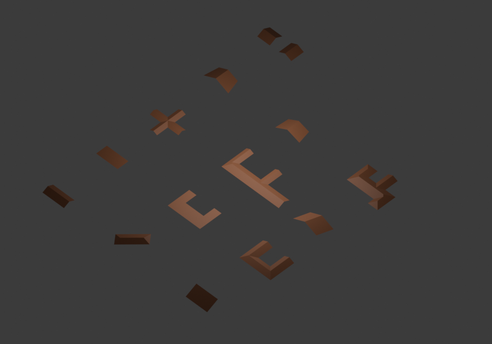
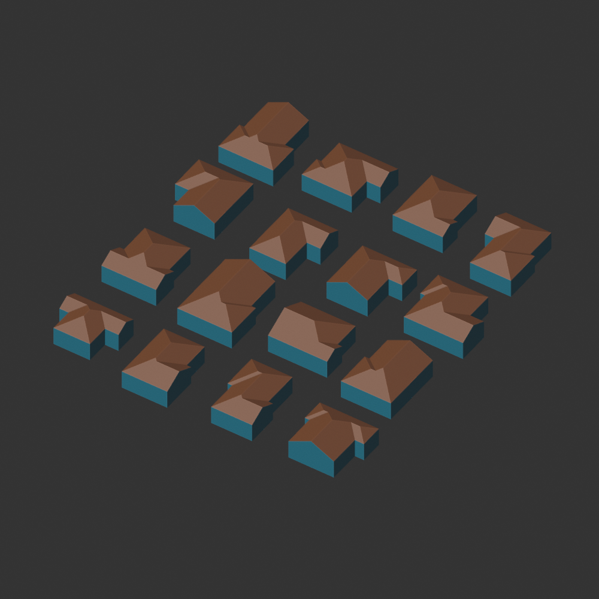

# Embedding roofs with fully declared face planes

## Current contract

Starting revision: `2e68c8b`. Canonical orthogonal gable generation constructs
continuous PolygonRoof candidates, converts each to an indexed RoofGraph and
GeometryProblem, checks incident planes, embeds and validates every candidate,
then selects a completed roof by stable seed. The topology backend and candidate
authority are outside this solver change.

Each slope constraint declares a fixed eave origin `o`, inward unit direction
`n`, and pitch `p`. Its equation is

```text
-p*n.x*x - p*n.y*y + z = o.z - p*(n.x*o.x + n.y*o.y).
```

If every face has a declared plane, all face planarity constraints are linear.
Fixed boundary XY and fixed height anchors eliminate variables. Ridge direction
cross products are also linear and may couple vertices. The current per-vertex
`check_planes` is necessary feasibility only: it neither checks those coupled
ridge equations nor solves positions.

The Ren covariance objective is zero at every feasible solution of this fully
specified system. Nonlinear finite differences and repeated eigensolves do not
add information here. This is constrained embedding of an already decided graph,
not plane-envelope topology discovery or a new roof generator.

## Linear solution and remaining freedom

Solve `A*delta = b-A*x_initial` once with normalized rows and deterministic
partial-pivot elimination. Rank deficiency is not automatically a failure: a
vertex incident to two planes may slide along their intersection. Retain all
constraints, and select the feasible correction minimizing squared XY movement,
the existing displacement objective. Express the affine solution as `delta=q+B*t`
and minimize `||q_XY+B_XY*t||²` only in the remaining nullspace. No regularizer
changes a hard plane, anchor or direction equation.

For a complete plane contract covering every vertex, `B_XY` has full column rank:
a nullspace movement with zero XY has zero Z in each incident plane (Z coefficient
is one), hence zero movement everywhere. Thus that displacement minimum is unique.
Unused vertices or numerical rank failure are explicit unsupported problems.

Recheck original signed plane distances and ridge equations at the same normalized
tolerance as nonlinear solve, preserve fixed coordinates exactly, then invoke the
unchanged RoofMesh validator. Inconsistent equations and invalid projected mesh
fail; neither a nonlinear retry nor another seed repairs them.

Graphs without a complete declared plane contract retain the covariance optimizer
as their explicit numerical problem class. Selection by available constraints is
not failure fallback. The generic optimizer and historical planarity proofs remain.

## Validation and performance plan

- Reproduce latest runtime L/T/U/Cross/Residential/Grid14/20/40 candidates and
  timing at the starting revision; profile Grid20 separately from unprofiled times.
- Compare all 995 saved successful whole-polygon meshes (741 grid, 149 nonuniform,
  101 structured, four image approximations) against linear incident-plane solutions.
  Those are historical comparison witnesses, not latest runtime coverage.
- Independently solve assembled constraints with NumPy least squares in tests;
  check rank-deficient freedom, conflicting anchors/directions and incomplete planes.
- Compare latest candidate IDs, rejected stages, architecture, graph incidence,
  geometry contract and multiple seed decisions before/after. Keep all candidates
  fully validated before seed; reducing their count is not this optimization.
- Run frozen runtime corpora, invariants, transformations and installed Blender
  smoke/native-base differential checks; report any changed acceptance explicitly.
- Measure embedding, mesh validation and whole generation separately, including
  function-call counts. Do not infer an overall 1000-building support rate from a
  repeated fixture performance batch.

## Measured results

Baseline source is `2e68c8b`; linear embedding is `c44c6f4`, local immutable layout
reuse is `ffb777f`, and the final benchmark driver is `64e5576`. Measurements use
Python 3.12.14 on the same Linux workspace. Final benchmark has nine unprofiled
samples after one warm-up; baseline has three. Raw candidate snapshots and
separate profiles are in [embedding evidence](embedding/). Source dirty flags
record documentation, tooling and release preparation present during measurement.

| Fixture | Valid candidates | Baseline median ms | Final median ms |
| --- | ---: | ---: | ---: |
| L | 1 | 48.452 | 10.194 |
| T | 1 | 31.063 | 10.304 |
| U | 1 | 97.833 | 10.008 |
| Cross | 7 | 370.330 | 45.229 |
| Residential | 1 | 249.750 | 17.380 |
| Grid14 | 2 | 535.929 | 24.872 |
| Grid20 | 8 | 9715.224 | 103.090 |
| Grid40 | — | unsupported polygon event | same unsupported polygon event |

Grid20 whole generation is about 94 times faster. All eight roofs are still
embedded and mesh-validated before seed selection. Across all seven successful
fixtures, all 21 candidate graphs, GeometryProblems, model/rejection records,
completion/work fields, candidate IDs and seed decisions for 0/1/7/42 are exactly
unchanged. Maximum coordinate distance is `2.7755575615628914e-17`.
[Comparison](embedding/comparison.json) retains the assertions' results.

A separate instrumented Grid20 sample measures all eight embeddings at 12.997 ms,
mesh validation at 41.971 ms, Graph construction at 32.813 ms, necessary plane
checks at 5.042 ms and GeometryProblem construction at 1.826 ms. Topology incidence
is 6.868 ms, minimum partition 2.813 ms, receiver guides 1.959 ms and end
recommendation 1.776 ms. These are stage observations, not additions to the
unprofiled median. All mesh crossing/projection checks remain enabled.

Separate cProfile captures drop from 61,165,291 calls (61,162,392 primitive) to
462,517 (462,098 primitive). Baseline invokes eight nonlinear optimizations and
155,364 covariance plane fits; final invokes neither for this fully declared
problem. Profiled duration is not used as the latency claim. Layout construction
also falls from nine calls to one: models reuse the immutable layout that already
produced their end recommendations, without a persistent cache or candidate pruning.

## Correctness and actual support

The [historical witness proof](embedding/witness-proof.json) confirms all 995
saved successful meshes: 741 grid, 149 nonuniform, 101 structured and four image
approximations. Face cycles remain identical, every reconstructed mesh passes
current validation, and the maximum vertex distance is `3.1031676915590914e-17`.
This is a coordinate comparison to independent stored results, not a claim about
995 newly sampled buildings or current overall coverage.

The frozen current corpus was separately run with the existing 15-second
per-input process budget. Raw stage counts are retained in
[coverage](embedding/coverage.json) and [all rows](embedding/coverage.jsonl.gz).
All Blender columns are unmeasured in this Python audit.

| Corpus | Inputs | Footprint | Partition | Architecture | Graph / problem | Solve / mesh |
| --- | ---: | ---: | ---: | ---: | ---: | ---: |
| Orthogonal grid stress | 1000 | 999 | 999 | 732 | 732 | 732 |
| Nonuniform orthogonal | 150 | 150 | 150 | 147 | 146 | 145 |
| Structured orthogonal | 103 | 103 | 103 | 101 | 100 | 100 |
| Convex quadrilateral | 48 | 48 | 48 | 48 | 48 | 48 |
| Structured oblique | 43 | 43 | 0 | 0 | 0 | 0 |
| General simple polygon probe | 40 | 40 | 0 | 0 | 0 | 0 |
| Structured branch network | 100 | 100 | 100 | 100 | 100 | 100 |

One grid input (`generated_0608`) is wall-budget censored in that raw run: its
false stage flags mean unobserved, not invalid footprint. A separate
[recheck](embedding/recheck-0608.json) completes in 373.520 ms with all 16 candidates
and the identical historical seed-0 choice. Including that recorded recheck gives
733 verified grid meshes, 1000 valid footprints and 1000 completed partitions.
All 673 previously successful grid inputs retain their selected ID and final mesh;
the additional 60 were previously wall-budget censored. This improves bounded
execution, not the topology grammar. The earlier bounded grid report has the same
15-second limit but a different machine/measurement epoch; it is not the timing
baseline for the speedup table. One existing wavefront work limit and 16 existing
end-model work limits remain incomplete search; unresolved event cases remain
unsupported. No failure is converted to another algorithm or seed.

The main audit started at `c44c6f4` and later workers include `ffb777f`'s layout
reuse. That changes allocation work only. The branch audit uses `ffb777f`.
Coverage timings are observations during validation, not isolated throughput
benchmarks. Final latency measurements were taken after those jobs completed.

228 unit tests pass, including an independent NumPy SVD/least-squares oracle,
coupled ridge constraints with sliding freedom, conflicting anchors and
directions, incomplete plane dispatch and failure without nonlinear retry.
NumPy remains a development oracle; no runtime dependency was added.

Blender 4.3.2 installed-ZIP smoke passes all 12 roof cases, UV/material checks,
square seed variation, compound failure atomicity and CLI. Native base smoke
passes four rectangle roof types, seven compound differentials, unsupported-seed
agreement, 16 demo buildings, and live flag/height updates. These selected Blender
cases do not imply conversion was measured for every corpus member.





## Reproduction and limits

```bash
git worktree add --detach /tmp/roof-baseline 2e68c8b
python python/benchmark_embedding.py --code-root /tmp/roof-baseline --samples 3 --profile --output python/out/before.json.gz
python python/benchmark_embedding.py --samples 9 --profile --output python/out/after.json.gz
python python/verify_plane_witnesses.py --output python/out/witnesses.json
python python/audit_coverage.py --corpus python/docs/canonical/coverage_inputs_v1.json.gz --seconds 15 --output python/out/coverage.json --details python/out/coverage.jsonl.gz
python python/audit_coverage.py --corpus python/docs/canonical/branch_network_inputs_v1.json.gz --seconds 15 --output python/out/branches.json --details python/out/branches.jsonl.gz
python python/benchmark_generation.py --samples 3 --buildings 1000 --output python/out/batch.json
python -m unittest discover -s python/tests
python python/build_addon.py --check --output packages/roof_generator-1.4.2.zip
```

Fully specified plane systems now avoid redundant nonlinear work. Problems
without those planes still require covariance optimization. Grid20 remains about
100 ms for the complete eight-candidate publisher, above the single-digit-ms
goal; fixed Graph construction and projection/intersection validation now dominate.
Candidate counts and validity checks were preserved. Non-orthogonal compound
decomposition, unresolved polygon events and incomplete model searches are not
solved by this numerical change.
