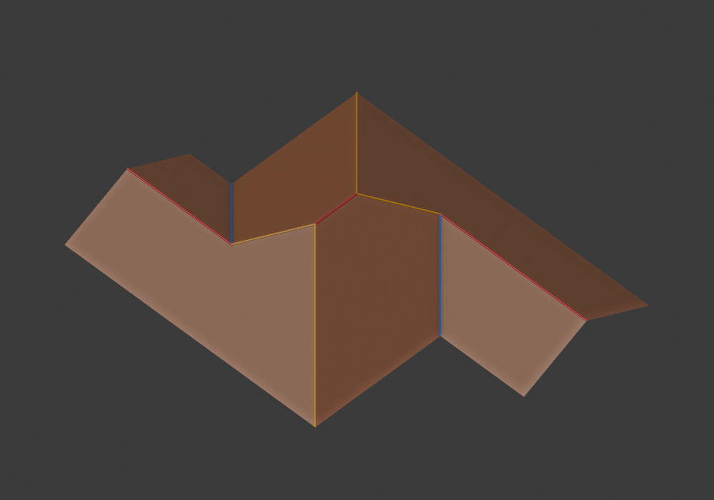
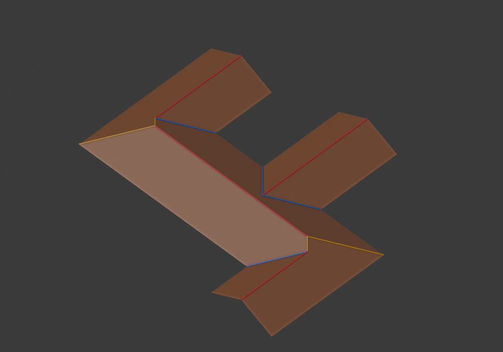

# Receiver regions in the canonical footprint generator

`generate_roof` now evaluates the existing minimum interpretation family and
a bounded receiver-region family together. This is partial production work:
the four-screenshot operator gate remains unmet, because images 1 and 3 still
have no supported model/merge configuration. The skeleton diagnostic has not
been promoted and no skeleton edge generates final roof topology.

## Region source and model contract

`receiver_regions` enumerates inclusion-maximal contained rectangles on the
footprint's boundary-coordinate arrangement. A prefix table validates their
coverage. Immediate one-band extensions determine maximality; there is no area
ranking or preferred ownership order. For each receiver, connected residuals
are explicitly proposed as separate exterior leaves only if each is rectangular.
Nonrectangular residuals reject this restricted family. All supports then pass
the common polygon coverage contract. Temporary boxes are computational data,
not semantic Cells or persistent Atoms.

`interpret_receiver` owns the roof model: one long-axis rectangular receiving
member with perpendicular exterior leaves. Receiver/leaf roles follow the
declared family and contact graph, not a largest-area score or an output roof.
A square receiver retains both domain directions until its contact constraints
resolve them. The published/adapted L/shared and branch-extension rules, global
end/symmetry constraints and whole-arrangement applicability still decide which
assignments construct. No new parallel, offset or partial-end Graph rule exists.
This source is our bounded adaptation of the documented receiver/branch model,
not a claimed verbatim partition algorithm from Laycock or Sugihara.

The actual polygon remains authority. Optional minimum-Cell intersections are
provenance only. No minimum Decomposition or certificate is fabricated for a
receiver. The original minimum producer retains its certified data and prior.

Search work counts coordinate-box visits, receiver trials and residual visits.
Each family has explicit work/axis/candidate budgets, with a combined roof-count
budget. These are operation bounds, not wall-time bounds. An unfinished family
invalidates selection even if another family has a mesh. All producers run
regardless of another producer's success; no failed roof triggers a retry path.

## Shared composition and selection

Both families reach the shared resolved-architecture composer. Candidate IDs
use actual model supports, Part ownership and canonical topology, rather than
producer iteration order. Equivalent minimum/receiver model identities get one
probability mass; the existing full-prior candidate is the alias representative.
Its legacy IDs and axes remain unchanged on equivalent models.

The complete orthogonal-gable candidate pool embeds every constructed minimum
candidate as well as receiver candidates before seed selection. Failed embedding
is reported, not repaired by changing Graph incidence. Cached meshes prevent
solving the selected candidate again. `prepare_generation` therefore now performs
embedding validation for this domain; it still creates no Blender scene objects.
Other roof types and the convex-quadrilateral domain retain their existing path.

The full minimum Hu prior and the receiver's partial parallel measurement have
different domains and are not compared as numeric scores. The best embedded
minimum-prior candidates and admissible receiver models remain inspectable
separately, then form the deduplicated seeded catalog. Unknown region priors
stay unknown, not preferred zero. The source can expand architectural choices
and change a seed's result; this is documented candidate-family expansion.

## Newly usable scenarios

Before integration, the default footprint regression failed on both screenshot
2 and 4 with unresolved parallel contacts. Both now pass `generate_roof`, solve,
mesh and the installed Blender operator without explicit region input:

| Input approximation | Default installed operator | Faces |
| --- | --- | ---: |
| Screenshot 1 | unsupported, atomic failure | — |
| Screenshot 2 | supported | 8 |
| Screenshot 3 | unsupported, atomic failure | — |
| Screenshot 4 | supported | 6 |
| Residential multi-reflex | supported | 8 |

The Residential case was also previously unsupported. Its accepted receiver
crosses original Cells and combines two shared terminal ends with one opposite
middle branch. It was inspected numerically and in Blender before updating the
old acceptance matrix. The smoke test now treats it as positive and retains
batch atomic-failure proof on the still-unsupported screenshot 3 approximation.





[Screenshot 2 authority diagram](authority/receiver-generation/diagrams/user_image_2_three_staggered_bands-0.svg)
and [screenshot 4 authority diagram](authority/receiver-generation/diagrams/user_image_4_two_staggered_rectangles-0.svg)
place minimum Cells, actual model regions/Parts and solved features with their
recorded architectural causes side by side. The newly successful nonuniform
`generated_0024` has an [installed operator image](authority/receiver-generation/nonuniform.png).

These are real installed-operator renders. Screenshot inputs remain grid-ratio
approximations, not recovered source meshes. No result claims all orthogonal
footprints are supported or that every geometric candidate is architecturally
preferred. The unchanged unknown offset and nonrectangular-model gaps still
prevent the full four-case gate.

## Inspection and validation

Core, coverage audit and installed operator now call the same candidate owner.
Inspection labels the first minimum partition as **provenance**, and displays
selected actual support polygons independently. Regional architectural-choice
counts are separate from minimum-prior counts. Candidate-validation timing
includes embedding; cached solve-stage time cannot be presented as a speedup.
The benchmark tool now measures the canonical family and explicitly records
that scope rather than continuing to measure minimum-only topology.

Focused regressions prove default region discovery, no internal zero-height
seam, geometry/Graph identity, cross-Cell support, rigid/seed invariance,
one probability mass for aliases, producer independence, incomplete-family
rejection and rejection of sources from another footprint. The final full suite
passed 177 tests in 90.915 seconds; the receiver suite has 9 tests including
failed-embedding evidence. The complete frozen canonical
audit reached mesh 5/1000 grid, 1/150 nonuniform, 32/103 structured and 48/48
convex quadrilaterals. The installed ZIP converted all 86 core-successful inputs;
unattempted inputs remain unsupported.
The supplemental 100-input branch audit reached mesh 100/100, with all prior
selected IDs and selectable counts unchanged, and installed Blender 100/100.

| Frozen corpus | Original goal baseline graph | Before integration mesh | After mesh | After installed Blender |
| --- | ---: | ---: | ---: | ---: |
| Grid 1000 | 3 | 4 | 5 | 5 |
| Nonuniform 150 | 0 | 0 | 1 | 1 |
| Structured orthogonal 103 | 13 | 13 | 32 | 32 |
| Branch 100 | 100 | 100 | 100 | 100 |
| Convex quadrilateral 48 | 48 | 48 | 48 | 48 |

[Core counts](authority/receiver-generation/coverage.json) and
[Blender conversions](authority/receiver-generation/blender-coverage.json)
record their separate stages. This remains partial general-orthogonal coverage.
The full audit predates the inspection-only constructibility separation and
the preallocation budget guard; [source receipts](authority/receiver-generation/sources.json)
identify that boundary. Neither change alters accepted model or mesh incidence.

## Performance cost

The full-mesh developer benchmark ran on a read-only `5706c50` snapshot and
the integration worktree, 3 samples after 2 warmups and 24 repeated buildings.
Both paths include selected mesh creation. The new path additionally embeds
all canonical candidates before seed; the old path embeds only its selected
minimum candidate. These are end-to-end costs of the changed contract, not
equivalent internal workloads. Both versions retain the bounded in-process
member-layout cache. No performance rewrite was made.

| Case | Before median ms | After median ms |
| --- | ---: | ---: |
| U | 425.90 | 651.63 |
| Cross | 98.87 | 311.39 |
| Residential | 13.57 (unsupported) | 351.35 (mesh) |
| Grid14 | 57.25 (unsupported) | 55.05 (unsupported) |
| Grid20 | 157.73 (unsupported) | 155.38 (unsupported) |
| Grid40 | 2635.82 (unsupported) | 2591.00 (unsupported) |

Raw [before](authority/receiver-generation/mesh-before.json) and
[after](authority/receiver-generation/mesh-after.json) include timings and
candidate fingerprints. Short single-host measurements do not establish a
speedup. U/Cross cost rose materially, Residential now performs real embedding,
and Grid40 remains far above a sub-second repeated-generation target.

```sh
python -m unittest discover -s python/tests -p test_receiver_generation.py
python -m unittest discover -s python/tests
python python/audit_coverage.py --corpus python/docs/canonical/coverage_inputs_v1.json.gz --output python/out/authority/receiver-coverage.json --details python/out/authority/receiver-coverage.jsonl.gz
python python/build_addon.py --output packages/roof_generator-1.3.0.zip
blender -b --factory-startup --python-exit-code 1 --python python/blender_authority_acceptance.py -- --zip packages/roof_generator-1.3.0.zip --inputs python/tests/fixtures/user_roof_images_v1.json --output-dir python/out/authority/blender-receiver-default
```
