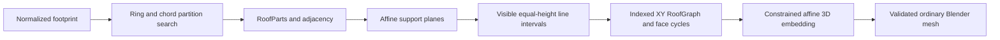

# Roof generation performance

## Algorithm and ownership

The production route is:



Partition candidates contain ordered coordinate rings and chords. Polygon
objects are constructed for the winning partition, whose coverage, adjacency
and source-edge provenance are checked independently. The selection objective
remains lexicographic: part count, aspect ratios, cut length, direction deviation
and deterministic signatures.

The connector represents each part by its support planes and affine domain
inequalities. It bounds equal-height lines, subtracts hidden line intervals,
nodes shared intersections and walks halfedges to obtain roof face cycles.
It does not repeatedly build, split or overlay polygon faces. GEOS remains
responsible for input/winning-part/output validation and hole tessellation.

The roof interpretation is an upper envelope of the parts' lower-envelope
supports. This interpretation still determines which roof faces are visible.
The graph is therefore constrained by geometry: relative part pitches, eave
heights and orientations can change its connectivity. This is not a purely
combinatorial topology selector followed by an unconstrained embedding solver.
There is no Ren et al. (2021) nonlinear optimization pass. Incident affine face
constraints already determine the supported roof families' planar embedding;
incompatible junction heights fail explicitly.

The indexed XY graph owns connectivity before mesh creation. Uniform pitch/eave
changes reuse it and restore the requested planes/heights. Both graph and
partition caches are bounded to 256 entries. Mandatory mesh validation runs
on every request, including cache hits. See
[the design](ROOF_GENERATOR_DESIGN.md) for constraints and numerical tolerances.

## Single-roof measurements

Linux x86_64, CPython 3.12.14, NumPy 2.3.5, Shapely 2.1.2, GEOS 3.13.1.
The comparison uses `9f96764` and the clean 1.1.0 commit `3710561` on the same machine,
with 11 measured samples and two warmups. Values are medians in milliseconds,
including the full public generation API and its validators. Cold measurements
clear every bounded geometry/partition/graph cache before each timed call.
Warm measurements retain the same footprint and roof constraints.

| Footprint | Before cold | Current cold | Before warm | Current warm |
| --- | ---: | ---: | ---: | ---: |
| Rectangle gable | 9.72 | 4.86 | 7.18 | 2.04 |
| L | 36.33 | 11.09 | 24.43 | 3.31 |
| T | 39.03 | 12.28 | 20.84 | 3.40 |
| U | 103.62 | 22.00 | 46.76 | 4.45 |
| Residential, multiple reflex vertices | 586.42 | 59.55 | 65.62 | 5.77 |
| Oblique L | 49.35 | 11.17 | 31.27 | 3.30 |
| General convex quad | 10.01 | 4.85 | 7.85 | 1.99 |

Blender 4.3.2 measurements additionally include evaluated source mesh reads,
object creation, UV layer, material and attribute creation. They use Blender's
CPython 3.13.5 / NumPy 2.2.4 and are separate from the core comparison:

| Footprint | Cold ms | Warm ms |
| --- | ---: | ---: |
| Rectangle gable | 6.95 | 3.47 |
| L | 14.77 | 5.48 |
| U | 29.04 | 7.38 |
| Residential, multiple reflex vertices | 76.89 | 8.22 |

The semantic harness compares 27 cases against frozen geometric/semantic
snapshots. All match; the 30-test suite covers the 16 mandatory final meshes and
parameter/transform/topology invariants. Installed-addon smoke validates the
actual editable meshes, UVs, materials and multi-selection conversion. Six
representative roofs are rendered for visual inspection.

## 1,000-building batches

The city benchmark uses 70% convex quadrilaterals (gable/hip/shed and oblique
examples), 15% L, 10% T, 4% U and 1% multi-reflex residential outlines. Pitches
vary. `unique_geometry` changes each footprint's aspect ratio, producing 1,000
graph-cache misses; `repeated_templates` reuses templates at different positions.
Each mode starts with empty bounded caches and, in Blender, an empty scene.

| Mode | Core, seconds | Blender objects, seconds |
| --- | ---: | ---: |
| Unique dimensions | 8.02 | 10.42 |
| Repeated templates | 2.80 | 4.57 |

Blender timing includes constructing 1,000 source meshes and converting them to
1,000 separate ordinary roof mesh objects with UVs, materials and attributes.
It excludes cleanup, Blender startup, dependency installation and saving the
reviewable `.blend` files. Full roof validation remains enabled.

`generate_objects` receives heterogeneous `RoofRequest` instances, obtains one
evaluated depsgraph and validates all inputs before changing scene objects or
source visibility. The conversion button calls the same API for all selected
footprints. This avoids repeated input depsgraph evaluation as each generated
object is added. Invalid input fails the entire batch before mesh creation.

The Blender batch's generation time divided by building count is an average
throughput measurement, not an individual roof latency percentile. A city can
contain much more expensive outlines than this mixture; the results do not
promise rebuilding an entire city every frame. Complex new footprints still
require partition search, and its bounded state limit can produce unsupported.
Interactive editing benefits from graph reuse; changing geometry or relative
part constraints can require a fresh solve.

## Reproduction

From the repository root, with the documented runtime dependencies installed:

```bash
python python/benchmark_roof.py --samples 11 --warmup 2 --output python/out/performance/core.json
python python/benchmark_city.py --buildings 1000
blender -b --factory-startup --python-exit-code 1 --python python/blender_benchmark_roof.py -- --samples 11 --warmup 2 --output python/out/performance/blender.json
blender -b --factory-startup --python-exit-code 1 --python python/benchmark_city.py -- --blender-objects --buildings 1000
```

Recorded measurements: [baseline core](performance/core_9f96764.json),
[current core](performance/core_3710561.json),
[Blender individual roofs](performance/blender_3710561.json), and
[city batches](performance/city_3710561.json). Current reports identify the clean
measured code commit and the runtime versions.

Reports record sample timings and the runtime versions. The city script also
saves the two complete Blender scenes under `python/out/performance/`.
