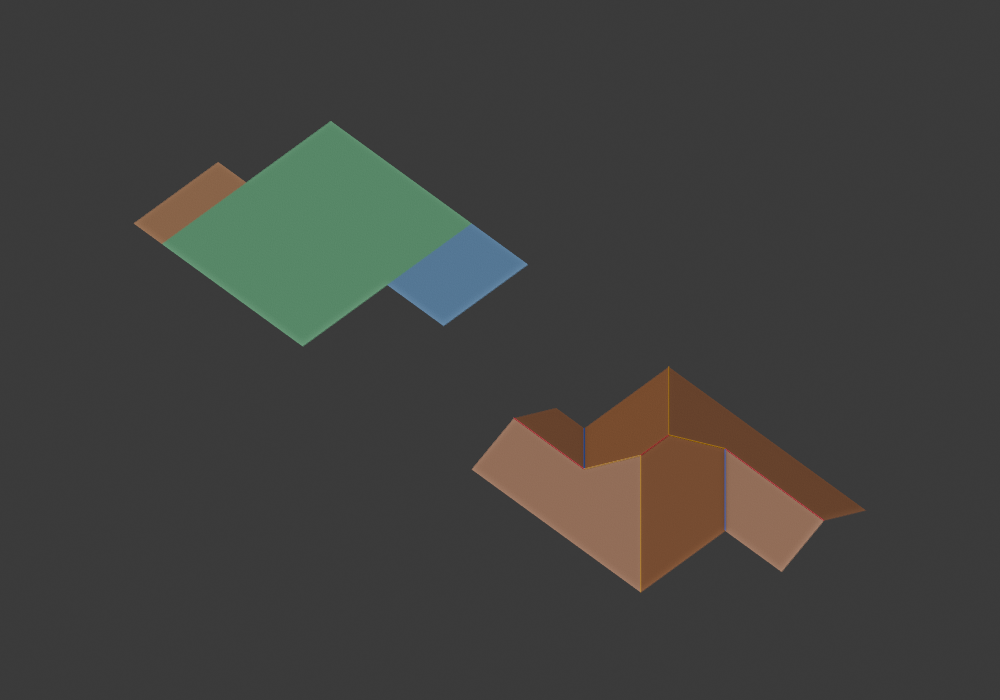

# Polygon regions through the shared composer

This is implementation and embedding evidence, not completion of the four
screenshot production gate. No further user authorization is needed to work
on that gate.

## Authority

`RoofRegionCandidate → MemberLayout → RegionPartGraph → resolved axes/ends →
compose → GeometryProblem → solve → RoofMesh` now works without a fabricated
minimum partition or certificate. `RegionPart.region` is the actual polygon;
its member IDs index declared supports, not source Cells. Shared-end choices
form compound parts by canceling the chosen support boundaries. Disconnected
or multiple boundary cycles reject; they are not repaired into new owners.

The existing minimum producer publishes its indexed supports through
`minimum_layout`. The same composer, end constraints and junction rules read
that geometry interface. No new parallel, offset or partial-end junction was
introduced. The legacy `cell`/`cells` fields in member, relation and graph
provenance records remain member indices in this common path. Actual source
Cell intersections remain exclusively in `RoofRegion.provenance`.

The rectangular model family explicitly considers both orthogonal ridge axes.
This is an explicit hypothesis domain, not an inference from source Cell long
edges or output meshes. Complete caps, applicable published L/branch incidence,
global end/symmetry constraints, graph validation and embedding determine
which hypotheses are supported. Nonrectangular models and unknown merge
arrangements reject. The default footprint generator still uses its existing
minimum-source orientation domain and recommendation policy.

## Four screenshot approximations

All saved, connected simple proposal sets enter together, including duplicate
minimum proposals. Source/order duplicates are removed by polygon identity.
The diagnostic searches the bounded declared rectangle/end model family;
`complete` does not claim all possible roof interpretations were enumerated.

| Input | Distinct support sets | Embedded roofs | Installed Blender explicit API |
| --- | ---: | ---: | --- |
| Image 1 | 29 | 0 | unsupported |
| Image 2 | 7 | 0 | unsupported |
| Image 3 | 9 | 0 | unsupported |
| Image 4 | 4 | 1 | rendered: 14 vertices, 6 faces |

Image 4 uses central `(1,0)`–`(6,6)` support, left `(0,0)`–`(1,3)` and right
`(6,3)`–`(8,6)` attachments, with axes `(0,1,0)`. Both L contacts choose shared
ends and all three members form one polygon Part. The central support crosses
both unchanged minimum Cells. The final valleys are shared-corner incidence;
none is an entire internal zero-height seam between independent roof models.
Graph incidence, semantics and geometry-problem face cycles are unchanged by
the solver. This is a screenshot approximation, not recovered original mesh.



Left: actual proposed supports. Right: installed Blender mesh; red ridge,
blue valley, yellow hip. This invokes the installed core explicit proposal API
and Blender mesh APIs. It is **not** a passing footprint operator test and
does not prove default proposal discovery.

Images 1 and 3 currently fail global end constraints for offset continuation,
partial-end or parallel contacts. Image 2 also reaches a compound choice whose
terminal/middle neighborhoods interact; other choices exceed the proved
isolated L-extension domain. These are topology/architecture applicability
limits, not ownership provenance failures. Results are in the saved report.

## Recommendation and seed

Architecture choices and applicable Hu parallel measurements are recorded
before graph construction. Constructible/embedded and selectable IDs are
reported separately. A transverse attachment lies outside the long-axis Hu
primitive scoring domain: its score stays `None`, never preferred zero.
Unscored valid candidates and the best scored embedded candidates remain
selectable; seed chooses only after all validation stages. An incomplete
search has no selectable candidates, even if an embedded candidate was found.

## Verification and next work

163 tests passed, including support geometry, partial Cell provenance,
end consumption, no zero-height internal seam, solver topology identity,
source/order-independent selection, budget exhaustion and forged-end rejection.
Installed Blender 5.2.2 LTS recomputed the same one embedded candidate from an
isolated ZIP and rendered it. Runtime needs the standard library only.

The shared-layout refactor initially revalidated the same source polygon
1,224 times on Grid40 (profiled). A bounded 64-entry cache now reuses immutable
source geometry, reducing those validations to 48, one per source partition.
Architecture/end decisions and seeded choices are not cached.

Unprofiled before/after measurements ran serially against a read-only snapshot
of `643755a` and current code, with 3 samples and 1 warmup. These measure
candidate generation, not solved mesh time:

| Case | Before median ms | After median ms | After first run ms |
| --- | ---: | ---: | ---: |
| U | 16.20 | 15.96 | 25.71 |
| Cross | 17.08 | 16.22 | 17.84 |
| Residential | 13.34 | 12.78 | 16.48 |
| Grid14 | 47.71 | 46.94 | 66.26 |
| Grid20 | 114.30 | 108.43 | 165.24 |
| Grid40 | 1991.89 | 2503.94 | 2412.93 |

All six family fingerprints and seeded IDs match the prior default pipeline.
Cold and repeated-input measurements are separate because the geometry cache
persists across calls. Grid40 is slower, including first-run region validation;
this is a measured cost of the current integration, not a performance fix.

Reproduction uses saved proposals as diagnostic inputs, never runtime assets:

```sh
python python/inspect_region_roofs.py --input python/docs/authority/regions/candidates.json --output python/out/authority/region-roofs.json
python -m unittest discover -s python/tests -p test_region_generation.py
python -m unittest discover -s python/tests
python python/build_addon.py --output python/out/authority/region-probe.zip
blender -b --factory-startup --python-exit-code 1 --python python/blender_region_probe.py -- --zip python/out/authority/region-probe.zip --proposals python/docs/authority/regions/candidates.json --output-dir python/out/authority/blender-region-probe
```

Set `BLENDER_USER_SCRIPTS` and `BLENDER_USER_CONFIG` to existing isolated
directories under `python/out/` before installing the diagnostic ZIP.

Remaining: supported model/merge configurations for images 1–3, runtime
proposal discovery together with existing candidates, four-case installed
operator acceptance, broader coverage and serial performance. Neither a
pipeline fallback nor a fixture-specific runtime proposal is an acceptable
substitute. Keep unknown arrangements unsupported until their incidence is
defined; do not remove valleys according to appearance or solver convenience.
