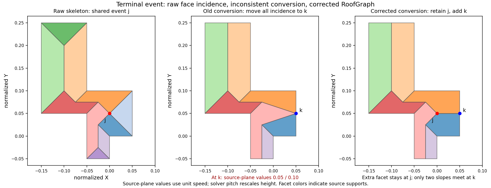

# Whole-polygon topology comparison

The controlled results support comparing a whole-polygon roof model rather
than adding more isolated rectangle junction operations. This is a prototype
decision, not promotion to the addon. The fixed comparison grammar is
`486abd60b1a44cadfaf419b787b7936bb3174908`.

## Causal result

All 1253 baseline inputs finished. Default selectable coverage remains grid
5/1000, nonuniform 1/150 and structured 32/103. A complete producer replay
agreed with the native audit on all 253 nonuniform/structured inputs before
being used for grid. Grid contains 827 inputs with no parallel-free modeled
assignment in either default source, not 999 inputs proved impossible because
of parallel. Another 17 are incomplete. The receiver source has 64 parallel-free
inputs; it removes parallel where minimum cannot in 32 inputs, but none of
those 32 reaches mesh. For structured, that same receiver change reaches mesh
in 11 of 27 such inputs. This separates upstream improvement from later grammar
failure.

The full all-axis ablation finished all 1253 attempts: grid 6 selectable with
435 incomplete searches, nonuniform 1 with 66 incomplete, structured 32 with
10 incomplete. Structured keeps exactly the same 32 successful inputs, adds
none and loses none. The grid/nonuniform comparison remains heavily censored
by the original budget; these numbers cannot establish a grammar upper bound.
On paired complete inputs (grid 565, nonuniform 84, structured 93), all-axis
adds only grid `generated_0920`, with no observed success lost. This is measured
against the original producer/grammar, not an arbitrary rectangle-cover limit.

The 100 small-input rectangle-cover oracle finishes 99, embeds six and produces
zero graphs for the other 93. The remaining input exhausts its cover budget.
This is failure within the boundary-coordinate rectangle domain and unchanged
grammar, not proof that arbitrary polygons cannot have roofs.

The recursive producer with unchanged grammar is especially informative:
all 100 small inputs finish and have a parallel-free model assignment, but
only six embed. The other 94 reach ends (33) or composition (61). Structured
recursion embeds 32/103, with 30 incomplete searches. Nonuniform recursion
embeds 1/150, with 113 incomplete searches. The recursive source adds no
selectable inputs in these comparisons. Its source snapshot is `c53a815`;
relative to baseline, only the recursive producer and extraction of the
existing region-boundary function differ. End, composition and solver modules
are byte-equivalent after normalized line endings.

These experiments rule out treating rejected parallel incidence or recursion
alone as the explanation. The current rectangular model/end/composition
grammar is a measured barrier even when parallel can be avoided.

## Isolated backend

`whole_polygon_roofs.py` uses the already pinned developer-only
`py_straight_skeleton==0.1.0` to propose whole-polygon face incidence. Its gable
adjustment follows [Laycock and Day, section 6.1 and Figure 3](https://dspace.zcu.cz/bitstream/11025/991/1/G67.pdf):
terminal intersections move to their incident exterior edge midpoints. The
paper text and the local PDF figure were inspected. The original probe
restricted this to triangular terminal faces with uniquely owned skeleton
nodes. It incorrectly moved those nodes even when additional source facets
shared them. The corrected prototype uses the oriented cap-disk replacement
below. Several caps sharing one event remain unsupported.

Adjacent facets with an identical oriented supporting exterior line are
aggregated by their oriented cycles. Redundant degree-two points on a straight
interior crease are suppressed in both incident cycles. These are incidence
normalizations, not appearance scores or new rectangle junction rules. Every
final edge receives its explicit meaning from source slopes and oriented face
incidence before solving. The single polygon support has owner 0; minimum Cells
do not decide its face boundaries.

The complete RoofGraph then enters the unchanged `problem` and `solve` API.
Skeleton event times and external XYZ are not geometry anchors. The graph,
boundary, projection and mesh validators are not weakened. Exceptions are
recorded, without jitter, alternate generators or fallback. This model includes
hip edges and gable ends, as does the existing compound gable model. A mesh
success does not prove the desired architectural style.

Completed prototype results:

| Frozen inputs | Rectangle-cover oracle | Recursive/current grammar | Whole polygon |
| --- | ---: | ---: | ---: |
| Small sample 100 | 6, one incomplete | 6, complete | 81, all attempted |
| Structured 103 | not run | 32, 30 incomplete | 101, all attempted |
| Nonuniform 150 | 18 included in small sample | 1, 113 incomplete | 149, all attempted |
| Factory approximations 4 | previous domain probe | default addon 2 | 4, all attempted |

After the cap-disk correction, complete comparisons are:

| Frozen inputs | Original whole polygon | Corrected whole polygon | Corrected timeouts |
| --- | ---: | ---: | ---: |
| Grid stress 1000 | 631 | 741 | 4 |
| Small sample 100 | 81 | 91 | 0 |
| Structured 103 | 101 | 101 | 0 |
| Nonuniform 150 | 149 | 149 | 0 |
| Factory approximations 4 | 4 | 4 | 0 |

Small prototype failures comprise nine topology/dependency failures and ten
embedding failures. All ten embedding failures share a specific upstream
condition: a relocated terminal cap node also belongs to an additional source
facet beyond its two adjacent supporting lines. None of the 81 embedded inputs
has this condition. **Correction:** the previous `embedding-witness.json`
measured the drawing AFTER terminal midpoint relocation, not the unmodified
skeleton. Recomputing the raw skeleton for all ten gives incident source-height
spread at most 2.8e-17. The inconsistent heights were introduced by the gable
conversion. The former wording "original drawing" was ambiguous and does not
support a claim that the raw skeleton was inconsistent.
The two structured failures and single nonuniform failure
come from external skeleton antiparallel-event handling. The original bounded
grid probe finished 1000 attempts: 631 mesh, 4 timeouts, 365 other failures.
Timeouts remain incomplete, not unsupported. Its source is the old midpoint
conversion, not the corrected cap-disk replacement.

Blender 5.2.2 LTS validates and renders the four factory approximations and
the first six successful small-sample inputs. This tests exported prototype
meshes, not the addon operator. Colored overlays read the published graph
edge meanings: red ridge, yellow hip, blue valley. Ten selected images are a
sanity check; they are not a human scoring oracle. The geometry remains one
continuous roof rather than independent roofs capped at minimum Cell cuts.

## Shared terminal event correction

For a triangular cap `(a,b,j)`, retain interior event `j` and introduce boundary
ridge end `k` at the midpoint of `(a,b)`. The neighboring slope cycles traverse
`a -> j` and `j -> b`; replace these paths by `a -> k -> j` and `j -> k -> b`.
Delete the cap facet. The original triangular disk is now covered by two
oriented triangles sharing `k-j`. Boundary order becomes `a-k-b`; the other
sectors at `j` are untouched. Three old edges are replaced by three new ones,
with one vertex added and one face removed, preserving Euler characteristic.
The two declared supports must be opposed; their equal-height locus includes
both `j` and `k`. Uniquely incident slope sectors are required. This is a
specific incidence operation, not coincident vertex duplication or jitter.



Ordinary degree-three cap events reduce to a degree-two straight ridge point,
which the existing incidence normalization suppresses. A multi-facet event
retains its other sectors and remains an interior junction. The unchanged
graph validator verifies its links; the unchanged geometry problem and mesh
validator verify embedding and footprint projection.

The corrected small comparison embeds 91/100, fixing all ten previous
embedding failures without losing any of the 81 successes. Structured remains
101/103, nonuniform 149/150, and factory approximations 4/4. The solver and
addon are unchanged. A separate read-only check derives facet gradients from
the solved meshes: all 345 successes have matching ridge/hip/valley meanings
and no valley with both endpoints at eave height. This is consistency evidence,
not an architectural-quality score. The corrected full grid run has completed:
741 mesh, 255 topology failures, and 4 timeouts. All 109 original embedding
failures now embed; the raw facet-domain audit confirms all 109 had an extra
source support at a relocated cap, and none of the original 631 successes did.
One original vertex-link failure (`generated_0699`) also now embeds; isolated
old/new replays reproduce that transition. There are no successful roofs lost.
Across grid, structured, nonuniform and factory inputs, all 995 successful
outputs pass the independent solved-slope edge-meaning check without zero-height
valleys. Small sample overlaps those corpora and is not added to this total.
Every previously successful graph in these four comparisons retains the same
seed/role/boundary, oriented face/support and edge-meaning signature after
ignoring node numbering. The ten new successes add the preserved junctions.

The original grid run also has 84 inputs rejected because two triangular caps
share an event (86 such events). Raw incidence inspection confirms that ALL
84 remove a neighboring slope support if both caps are consumed. This is a
different family from relocating a single cap with an extra incident facet:
it requires a compatible boundary end configuration, not simply duplicating
the common event. `multiple-cap-frontier.json` records the source cap edges
and surviving incident supports. No alternate end configuration has been
silently selected to rescue those inputs.

## External antiparallel events

Calling only `compute_skeleton` reproduces the structured failures `comb_6`
and `residential_multi_reflex_9`, and nonuniform `generated_0015`; no roof
conversion or optimizer is called. In all three, opposite original supports
reach the library's `compute_from_edges` fallback. Its second containment check
uses a 0.26-degree collinearity tolerance and the default `RAISE_ERROR` policy.
The current LAV segments are classified as antiparallel, raising before a
direction is resolved. Original segments, event coordinates, candidate vectors
and relative-path stack frames are recorded in `skeleton-events.json`.
This locates the exception inside dependency event handling. It does not prove
that changing a tolerance or selecting a direction would yield a valid complete
skeleton; neither modification is used as a repair.

## Additive-weighted comparison boundary

[Held and Palfrader, sections 3.1, 3.2 and 4.1, Figure 12](https://arxiv.org/abs/1604.03362)
define delayed edge motion, including edges that collapse before starting.
Those edges generate vertical wall/gable facets without an inclined roof facet.
The roof need only be weakly z-monotone, and a projected edge-face can have
empty or disconnected interior. This is a different propagation algorithm,
not a weight parameter supported by the installed ordinary-skeleton package.

For this project's current contract, sloped facets must have positive planar
projection and an exterior eave support. Vertical walls cannot be inserted as
RoofFaces. An eventual weighted comparator must explicitly separate wall
facets from the sloped roof and verify that the latter covers the footprint.
Finite delays that create raised sloped facets also exceed the current
zero-height exterior-support contract. A first comparison can restrict moving
edges to zero delay and gable edges to delay beyond collapse, with explicit
simultaneous-event handling. No weighted implementation, equivalence to this
local disk replacement, or weighted coverage result is claimed here.
For the ten failing caps a closed-form local delayed-front witness was also
computed: delay is chosen beyond the terminal corridor's collapse, neighboring
fronts shorten the stationary end to its midpoint at half its width. This time
matches the retained raw event; the extra source front reaches that event but
has positive clearance at the boundary midpoint. This explains why those two
nodes must have different facet incidence. It checks local kinematics only,
without pretending to simulate a global weighted wavefront.

## Visual and timing evidence

Blender additionally validates and renders the corrected U, Cross, staircase,
comb, Residential and grid40 representatives, nonuniform 8/22/40-vertex inputs,
and a repaired shared event (ten meshes). All ten images were inspected. Cross
and comb show continuous ridge/branch structures. Staircase and complex random
inputs retain many hips; their intended gable architecture remains a separate
gate. The images are under `authority/whole-polygon/blender-whole-polygon-split`.

An in-process developer Python measurement on those ten inputs gives warm
median 206 ms and observed maximum 2544 ms across three repeats each; imports
take 141 ms. These are backend calls, excluding process startup and Blender/UI,
with the grid batch running concurrently. This is descriptive timing, not a
controlled performance comparison or an interactive-speed acceptance result.
`prototype-timing.json` records each first call and warm repeats. Some complex
inputs still exceed the project's sub-second repeated-update target; no
performance optimization has been attempted in this phase.

## Remaining gate

The corrected grid's 255 topology failures consist of 144 antiparallel-direction
dependency exceptions, 84 conflicting multiple-cap configurations, and 27 other
dependency failures. Four additional inputs time out. There are no remaining
embedding failures among constructed graphs. Detailed exceptions and input
identities are in `grid-failure-frontier.json`; do not group these failures into
"solver did not converge" or count incomplete cases as unsupported.
Handle simultaneous skeleton events without input perturbation. Verify edge
semantics independently against solved slopes and transforms. Decide whether
this whole-polygon model supplies the intended gable architecture, including
its retained hips; do not equate high mesh coverage with architectural quality.
The optional dependency, execution cost and packaging remain outside the
stdlib-only addon contract. No production backend switch has occurred.
Production promotion also requires an explicit architectural end-choice policy
and assessment of its retained hips. This deterministic cap policy does not
yet provide the existing generator's seed-selected architectural alternatives.

Commands (from repository root):

```powershell
python python/whole_polygon_roofs.py --code-root python/out/authority/causal-baseline-486abd6 --deps python/out/laycock-deps --inputs python/docs/authority/causal/causal-small-inputs.json --output python/out/authority/whole-polygon-small.json
python python/probe_recursive_roofs.py --code-root python/out/authority/causal-recursive-c53a815 --source-sha c53a815bdff00e47c43dcd45b82f04baa6015e70 --inputs python/docs/canonical/coverage_inputs_v1.json.gz --category structured_orthogonal --output python/out/authority/causal-recursive-structured.json
blender -b --factory-startup --python-exit-code 1 --python python/blender_topology_probe.py -- --report python/out/authority/whole-polygon-images.json --output-dir python/out/authority/blender-whole-polygon-images --limit 4
python -m unittest python.tests.test_whole_polygon_roofs python.tests.test_causal_frontier
python python/audit_gable_caps.py --report python/docs/authority/whole-polygon/whole-polygon-small.json.gz --output python/out/authority/gable-cap-frontier.json
python python/whole_polygon_batch.py --code-root python/out/authority/causal-baseline-486abd6 --deps python/out/laycock-deps --inputs python/docs/canonical/coverage_inputs_v1.json.gz --category orthogonal_grid_stress --resume python/out/authority/whole-polygon-grid.json --seconds 15 --output python/out/authority/whole-polygon-grid-bounded.json
python python/whole_polygon_batch.py --code-root python/out/authority/causal-baseline-486abd6 --deps python/out/laycock-deps --inputs python/docs/canonical/coverage_inputs_v1.json.gz --category orthogonal_grid_stress --seconds 15 --output python/out/authority/whole-polygon-split-grid.json
python python/trace_skeleton_events.py --code-root python/out/authority/causal-baseline-486abd6 --deps python/out/laycock-deps --small-inputs python/docs/authority/causal/causal-small-inputs.json --corpus python/docs/canonical/coverage_inputs_v1.json.gz --reports python/docs/authority/whole-polygon/whole-polygon-small.json.gz python/docs/authority/whole-polygon/whole-polygon-structured.json.gz python/docs/authority/whole-polygon/whole-polygon-nonuniform.json.gz --categories per-row structured_orthogonal nonuniform_orthogonal --output python/out/authority/skeleton-events.json
python python/audit_polygon_mesh.py --reports python/out/authority/whole-polygon-split-small.json python/out/authority/whole-polygon-split-structured.json python/out/authority/whole-polygon-split-nonuniform.json python/out/authority/whole-polygon-split-images.json --output python/out/authority/polygon-mesh-semantics.json
python python/plot_cap_event.py --trace python/docs/authority/whole-polygon/skeleton-events.json --before python/docs/authority/whole-polygon/whole-polygon-small.json.gz --after python/docs/authority/whole-polygon/whole-polygon-split-small.json.gz --category orthogonal_grid_stress --name generated_0685 --output python/docs/authority/whole-polygon/cap-disk-comparison.png
```

The first unbounded grid probe stopped advancing on the twentieth input for
over ten minutes and was interrupted. The bounded batch isolates each input
with a 15-second wall budget. A timeout is `search_incomplete`, not unsupported,
and cannot establish impossibility. Its initial 19 completed rows are reused
only after checking corpus, prototype source, core hashes and exact prefix.
